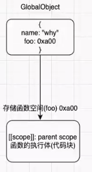
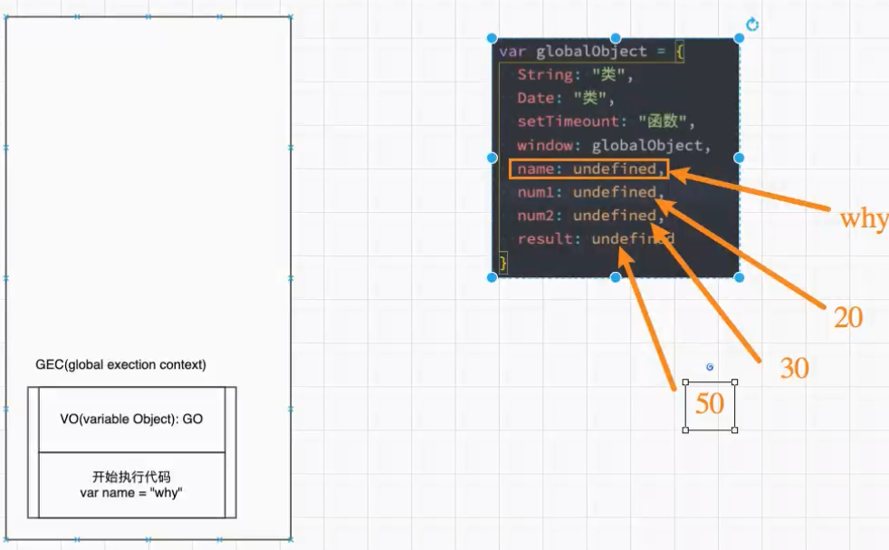
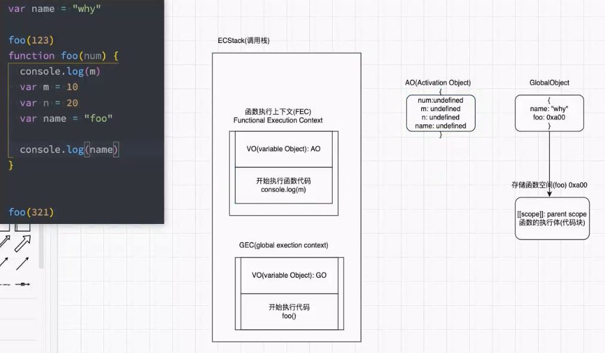
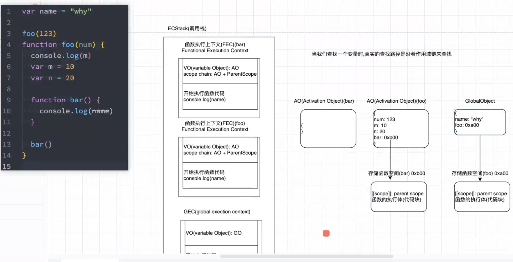

## 1.编译阶段

* 在执行代码先，V8引擎会将代码进行解析 ，创建一个**GlobalObject**,简称**GO**，该对象所有作用域都可以访问
* JS中可以直接使用全局的**Math、Data、String等类，**以及**setTimeout、console等函数,**这些都是在解析阶段添加到**GO**中的
* 在**GO**全局对象中还有**window**属性，而这个**window**对象又指向当前的这个**GO**对象,所以window.window.window....可以存在

```js
var num = 10;
var name = 'tqa';

function foo(name){
    var message = "your name is";
    console.log(message + name);
}

/*下面为v8引擎的解析阶段GO对象，以伪代码的形式表达*/
var GlobalObject = {
	String："类"，
    Data："类"，
    setTimeout："函数"，
    ....
    window: GlobalObject,
    num：undefined，//变量提升
    name：undefined，
    foo："内存地址" //函数只进行预解析，指向函数的内存地址
}
```

### 函数的存放

存储函数的空间中会存放父级作用域和函数的代码块，而函数的存储空间是在解析阶段就确定了，所以函数的父级作用域是函数定义时确定的，与函数的执行位置没有关系<br>


## 2.运行阶段

* 在执行阶段V8内部有一个执行上下文栈（execution context stack，简称ECS或者ECStack）

* 首先执行全局代码，需要创建全局上下文执行栈**(Global Excution Context，GEC)**

* GEC中有个VO对象，开始时VO指向GO

* 开始执行代码，首先执行`var num = 10;`，会找VO，由于VO指向GO，所以可以直接将GO中的num赋值为10，
  同理执行下一行，将name赋值为'tqa'
  
* 再开始执行函数foo；首先会创建**AO(Activition Object)**对象，AO对象与GO对象类似，只不过是函数的预解析对象

* 然后开始创建**函数执行上下文栈(FEC)**，FEC中VO指向AO对象

* 然后开始执行函数，如果函数作用域AO对象不存在该变量，则会在函数的上一级作用域中查找。上一级没有则会再去上一级作用域查找，这就是作用域链。

* 无函数的代码执行过程

* 有函数的代码执行过程

* 函数嵌套的执行过程

  

* **当函数中的代码执行完毕就会销毁调用栈中创建的AO执行上下文，并且销毁内存中创建的AO对象（闭包需特殊考虑）**

## 3、例题

```js
//1
var num = 10;
function foo() {
  n = 200; // n 为全局变量
}
foo();
console.log(n); // 200

//2
function foo() {
  console.log(n);
  var n = 200;
  console.log(n);
}
var n = 100;
foo();//undefined,200

//3
var message = "HRLLO";
function foo() {
  console.log(message);
}
function fun() {
  const mssage = "你好"
  foo();
}
fun();//结果：HELLO
/*
前面说了函数的父级作用域是如何定义的。
由于函数foo是在全局定义的，所以函数的父级作用域是全局作用域GO,那么在foo函数作用域找不到message，则会去全局作用域查找
*/

//4
var a = 100;
function foo() {
  console.log(a);
  return;
  var a = 100;
}
foo();//undefined
/*
虽然函数的内部定义的a在return后面，但是函数在解析生成AO对象时，并不会管return，所有的变量都会解析，之后执行阶段才会解析
*/

//5
function foo() {
  var a = b = 100;
  /* 
    js定义得分开定义再赋值，
    上面的写法相当于：
    b = 100;
    var a = 100;
    而在函数中不定义直接赋值变量，相当于定义了全局变量
  */
}
foo();
console.log(a);//报错未找到a，函数执行完毕之后函数执行上下文被销毁，找不到变量
console.log(b);//100
```


