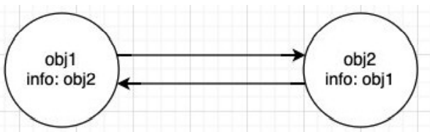

## JS的内存管理

* JavaScript会在定义变量时为我们分配内存。
* 但是内存分配方式是一样的吗？
  * JS对于基本数据类型内存的分配会在执行时， 直接在栈空间进行分配； 
  * JS对于复杂数据类型内存的分配会在堆内存中开辟一块空间，并且将这块空间的指针返回值变量引用

## JS垃圾回收

1. 因为内存的大小是有限的，所以当内存不再需要的时候，我们需要对其进行释放，以便腾出更多的内存空间。 
2. 在手动管理内存的语言中，我们需要通过一些方式自己来释放不再需要的内存，比如free函数： 
   1. 但是这种管理的方式其实非常的低效，影响我们编写逻辑的代码的效率； 
   2. 并且这种方式对开发者的要求也很高，并且一不小心就会产生内存泄露； 
3.  所以大部分现代的编程语言都是有自己的垃圾回收机制： 
   1. 垃圾回收的英文是**Garbage Collection，简称GC**； 
   2. 对于那些不再使用的对象，我们都称之为是垃圾，它需要被回收，以释放更多的内存空间； 
   3. 而我们的语言运行环境，比如Java的运行环境JVM，**JavaScript的运行环境js引擎都会内存垃圾回收器**； 
   4. **垃圾回收器我们也会简称为GC**，所以在很多地方你看到GC其实指的是垃圾回收器； 
4. 但是这里又出现了另外一个很关键的问题：GC怎么知道哪些对象是不再使用的呢？ 
   1. 这里就要用到**GC算法**

### 常见的GC算法 – 引用计数

* **引用计数：**
  * 当一个对象有一个引用指向它时，那么这个对象的引用(**retain count**)就+1，当一个对象的引用为0时，这个对象就可以被销 毁掉； 
  * 这个算法有一个很大的弊端就是会产生循环引用,当两个对象里面的属性相互引用彼此，对象引用就不为0，会一直占用内存

### 常见的GC算法 – 标记清除

* **标记清除**： 
  * 这个算法是设置一个根对象（root object），垃圾回收器会定期从这个根开始，找所有从根开始有引用到的对象，对于哪些没有引用到的对象，就认为是不可用的对象； 
  * **这个算法可以很好的解决循环引用的问题，下图中虽然m与n对象都相互引用，但并不在根结点的图上，所以会被清除**