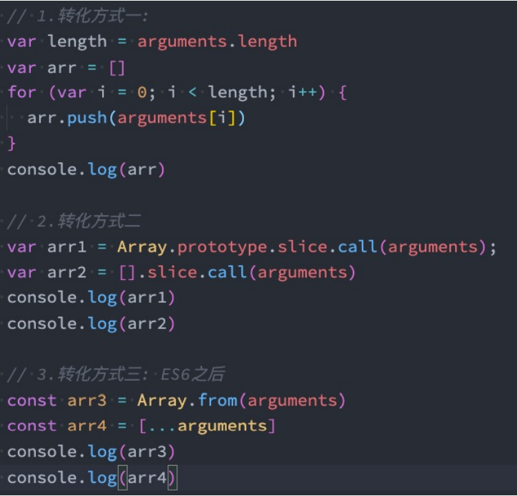

## arguments是什么？

>arguments 是一个 对应于 传递给函数的参数 的 **类数组(array-like)对象**
>
>**现在一般不用arguments，用的是剩余参数，毕竟箭头函数么有arguments**

* array-like意味着它不是一个数组类型，而是一个对象类型： 
  * 但是它却**拥有数组的一些特性**，
    * 比如说length，
    * 比如可以通过index索引来访问； 
  * 但是它却**没有数组的一些方法**，
    * 比如forEach、map等；

## arguments转成array

