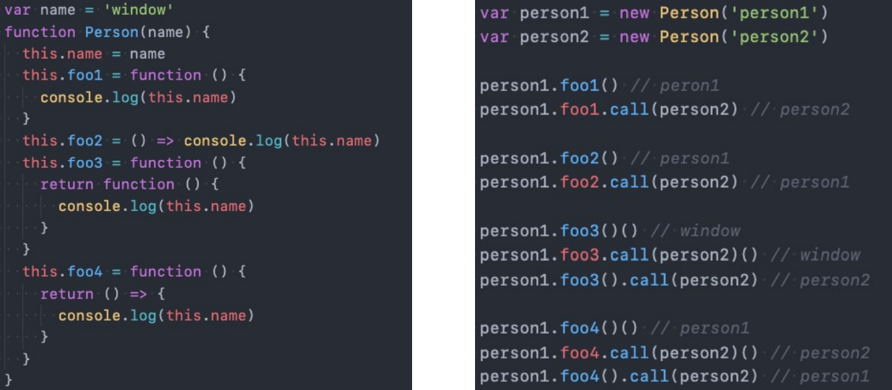

# 01.this绑定机制

* 1.函数在调用时，JavaScript会默认给this绑定一个值；
* **2.this的绑定和定义的位置（编写的位置）没有关系；** 
* **3.this的绑定和调用方式以及调用的位置有关系；** 
* **4.this是在运行时被绑定的；**


# 02.this绑定规则

## 规则一：默认绑定

**定义：**独立的函数调用我们可以理解成函数没有被绑定到某个对象上进行调用

```js
//1.案例一;
function foo(){
	console.log(this);
}
foo();

//2.案例二;
function test1(){
    console.log(this);
    test2();
}
function test2(){
    console.log(this);
    test3();
}
function test3(){
    console.log(this);
}
test1();

//·3.案例三:
function foo(func){
    func()
}
var obj = {
	name: "why",
	bar: function(){
		console.log(this);
    }
}
foo(obj.bar);//虽然这里是obj.bar,看起来像隐式绑定，但传递给foo后，func形参指向obj.bar,相当于func()自己调用。

/* 三个都是指向window */
```

## 规则二：隐式绑定

**定义：**也就是它的调用位置中，是通过某个对象发起的函数调用。

```js
//1.对象绑定
function foo() {
  console.log(this);  //obj对象
}
var obj = {
  name: "why",
  foo: foo
}
obj.foo(); //obj

//2.对象绑定
var obj1 = {
  name: "obj1",
  foo: foo
}
var obj2 = {
  name: "obj2",
  obj1: obj1
}
obj2.obj1.foo();//obj1

//3.直接调用
function foo() {
  console.log(this);
}
var obj1 = {
  name: "obj1",
  foo: foo
}
//将obj1的foo赋值给bar
var bar = obj1.foo;
bar();//window

//4.BOM方法调用
var box = document.querySelector( ".box " );
box.onclick = function(){
	console.log(this = box);//this指向的是点击事件的调用者
}
```

## 规则三：显示绑定

* **通过call、apply、bind调用函数，强制改变this指向**

* **注意：如果在显示绑定中，我们传入一个null或者undefined，那么这个显示绑定会被忽略，使用默认规则：**

  ```js
  function foo(){
  	console.log(this);
  }
  var obj = {
  	name: "why"
  }
  foo.call(obj);      //obj对象
  foo.call(null);     //window
  foo.call(undefined);//window
  var bar = foo.bind(null);
  bar(); //window
  ```

  

## **规则四：内置函数的绑定**

```js
//01.BOM,点击事件，也是隐式绑定
var box = document.querySelector( ".box " );
box.onclick = function(){
	console.log(this = box);//this指向的是点击事件的调用者
}

//02.setTimeout 
setTimeout(function(){
	console.log(this);//- window
},1000);

//03.改变setTimeout中this指向
var obj={
	data: [],
    //方式一：提前拷贝this
	getData: function() {
		var _this = this;
		setTimeout(function() {
			var res =-[ "abc", "cba", "nba" ];
        	_this.data.push( ...res);
		}，1000);
	},
    //方式二：使用箭头函数
    getMessage: function() {
		setTimeout(() => {
			var res =[ "abc", "cba", "nba" ];
        	 this.data.push(...res);//由于箭头函数没有this，所以会去上层作用域选择this
		}，1000);
    }
}


//03.数组方法
var names=[ "abc", "cba",  "nba" ];
var obj={ name : "why"};
names.forEach(function (item){
    console.log(this);//三次打印obj对象
}, obj);//forEach方法最后一个参数可以改变this的指向，如果没有最后一个参数this默认指向window

```


## 规则五：new绑定

* 使用new关键字来调用函数是，会执行如下的操作： 
  * 1.创建一个全新的对象； 
  * 2.执行函数体内容，这个新对象会被执行prototype连接； 
  * 3.这个新对象会绑定到函数调用的this上（this的绑定在这个步骤完成）；
  * 4.如果函数没有返回其他对象，表达式会返回这个新对象

```js
   function fun(num) {
      console.log(this); //fun{num：**， foo：**}
      this.foo = function () {
        console.log(this); //fun{num：**， foo：**}
      }
    }
    const obj = new fun();
    obj.foo();
    console.log(obj);////fun{num：**， foo：**}
```


## 直接创建对象与使用构造函数创建对象区别

```js
function foo(num) {  
  console.log("obj1.this", this);
  this.num = num;
  this.fun = () => {
    console.log("obj1.num", this.num);
  }
}
const obj1 = new foo(11);
const obj2 = {
  //对象没有作用域，this指向上层作用域
  that: console.log("obj2.this", this),
  num: 11,
  // 如果是箭头函数 this.name = undefined
  fun: function () {
      console.log("obj2.num", this.num);
  }
}
obj2.that;
obj1.fun();
obj2.fun();
console.log('obj1:', obj1);
console.log("obj2:", obj2);
```


# 03.规则优先级

* **1.默认规则的优先级最低** 
  * 毫无疑问，默认规则的优先级是最低的，因为存在其他规则时，就会通过其他规则的方式来绑定this 
* **2.显示绑定优先级高于隐式绑定** 
  * 代码测试 
* **3.new绑定优先级高于隐式绑定** 
  * 代码测试 
* **4.new绑定优先级高于bind** 
  * new绑定和call、apply是不允许同时使用的，所以不存在谁的优先级更高 
  * new绑定可以和bind一起使用，new绑定优先级更高 
  * 代码测试

# 04.面试题

面试题1<br>

面试题2<br>

面试题3<br>

面试题4<br>