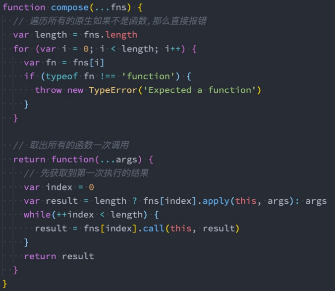

## 纯函数

* **定义：**
  * 确定的输入，一定会产生确定的输出； 
  * 函数在执行过程中，不能产生副作用；
* **为什么纯函数在函数式编程中非常重要呢**
  * 因为你可以安心的编写和安心的使用； 
  * 写代码时保证了函数的纯度，只是单纯实现自己的业务逻辑即可，不需要关心传入的内容是如何获得的或者依赖其他的外部变量是否已经发生了修改； 
  * 你在用的时候，你确定你的输入内容不会被任意篡改，并且自己确定的输入，一定会有确定的输出；
* **React中就要求我们无论是函数还是class声明一个组件，这个组件都必须像纯函数一样，保护它们的props不被修 改**
* **纯函数的来源**
  * 更改文件系统
  * 往数据库插入记录
  * 发送一个http请求
  * 可变数据
  * 打印/Log
  * 获取用户输入
  * DOM查询
  * 访问系统状态
* **纯函数的js方法**
  * **concat**：连接多个数组，返回新的数组
  * **join**：将数组中所有元素以参数作为分隔符放入一个字符
  * **slice**：slice(start,end)，返回选定元素，与splice对应
  * **map,filter,forEach,some,every,reduce**等不改变原数组
* 非纯函数会改变原数组的方法
  * **shift**、**unshift**、**pop**、**push**
  * **reverse**：颠倒数组顺序
  * **sort**：对数组排序
  * **splice**:splice(start,length,item)删，增，替换数组元素，返回被删除数组，无删除则不返回
  * **fill**:用一个元素填充原来的数组

---

## 柯里化

* **定义：**只传递给函数一部分参数来调用它，让它返回一个函数去处理剩余的参数； **这个过程**就称之为柯里化

* **表现**

  ```js
  // 未柯里化的函数
  function add1(x, y, z){
    return x + y + z
  }
  console.log(add1(10, 20, 30));
  
  // 柯里化处理的函数
  function add2(x){
    return function(y){
      return function(z){
        return x + y + z
      }
    }
  }
  console.log(add2(10)(20)(30));
  
  // 箭头函数
  const add3 = x => y => z => x + y + z;
  console.log(add3(10)(20)(30));
  ```

* 那么为什么需要有柯里化呢？

  * 在函数式编程中，**我们其实往往希望一个函数处理的问题尽可能的单一，而不是将一大堆的处理过程交给一个函数来处理；** 
  * 那么我们是否就可以将每次传入的参数在单一的函数中进行处理，处理完后在下一个函数中再使用处理后的结果
  * **柯里化的场景是可以帮助我们可以复用参数逻辑：**

* 柯里化实现复用

  * 这里演示一个案例，需求是打印一些日志

    * 日志包括时间、类型、信息；

  * 非柯里化

    ```js
    function log(date, type, message) {
      console.log(`[${date.getHours()}:${date.getMinutes()}]·[${type}][${message}]`)
    }
    log(new Date(),"DEBUG","修复问题")
    log(new Date(), "FEATURE","新功能")
    ```

  * **柯里化**

    ```js
    var log= date => type => message => console.log(`[${date . getHours()}:${date. getMinutes()}][${type}]·[${message}]`)
    var logNow = log(new Date())
    logNow("DEBUG")("轮播图bug")
    logNow("DEBUG")("点击无效bug")
    logNow("FEATURE")("添加新功能")
    var logNowDebug = log(new Date())("DEBUG")
    logNowDebug("轮播图bug")
    logNowDebug("点击无效bug")
    ```

* **自动柯里化函数**

  ```js
  function hycurrying(fn) {
    function curried(...args) {
      // 如果参数已经大于等于传递函数的参数了，就可以调用了，
      // 函数的 length 属性可以得到有多少个参数
      if (args.length >= fn.length){
        // 不能直接调用，否则会改变当前this的指向，使其直接指向window
        return fn.apply(this, args)
      }else{
        // 参数不够就返回一个函数，该函数可以继续调用curried
        return function(...args2){
          return curried.apply(this, args.concat(args2))
        }
      }
    }
    return curried
  }
  ```


## 组合函数

* 组合（Compose）函数是在JavaScript开发过程中一种对函数的使用技巧、模式： 
  * 比如我们现在需要对某一个数据进行函数的调用，执行两个函数fn1和fn2，这两个函数是依次执行的； 
  * 那么如果每次我们都需要进行两个函数的调用，操作上就会显得重复； 
  * 那么是否可以将这两个函数组合起来，自动依次调用呢？ 
  * 这个过程就是对函数的组合，我们称之为 组合函数（Compose Function）；
* **实现组合函数**<br>


