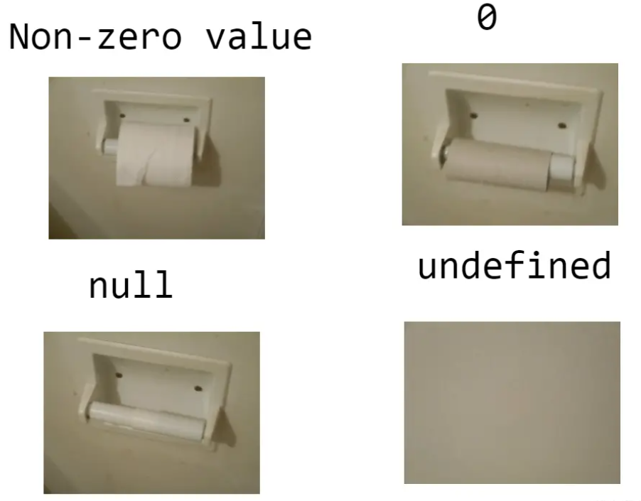

## 简单区分

总的来说 `null` 和 `undefined` 都代表空，主要区别在于 `undefined` 表示尚未初始化的变量的值，而 `null` 表示该变量有意缺少对象指向。

- `undefined`

- - 这个变量从根本上就没有定义
  - 隐藏式 空值

- `null`

- - 这个值虽然定义了，但它并未指向任何内存中的对象
  - 声明式空值
  - <br>

## 在JS中的区别

### typeof

```js
typeof null  // 'object'
typeof undefined  // 'undefined'
```

### Object.prototype.toString.call

```js
Object.prototype.toString.call(null) // '[object Null]' 
Object.prototype.toString.call(undefined) // '[object Undefined]'
/*toString() 是 Object 的原型方法，调用该方法，默认返回当前对象的 [[Class]] 。这是一个内部属性，其格式为 [object Xxx] ，其中 Xxx 就是对象的类型。*/
```

### == 与 ===

```js
null == undefined  // true
null === undefined  // false
!!null === !!undefined  // true

/*js
### Object.getPrototypeOf\(Object.prototype\)
`JavaScript` 中第一个对象的原型指向 `null` 
*/
```

### \+ 运算 与 Number

```js
let a = undefined + 1  //NaN 
let b = null + 1  // 1 
Number(undefined)  // NaN 
Number(null)  //0
```

### JSON

```js
JSON.stringify({a: undefined})  // '{}' 
JSON.stringify({b: null})  // '{b: null}' 
JSON.stringify({a: undefined, b: null})  // '{b: null}'
```


## 深入探索

### 为什么 typeof null 是 object？

**`typeof null` 输出为 `'object'` 其实是一个底层的错误，但直到现阶段都无法被修复。原因是，在 `JavaScript` 初始版本中，值以 `32位` 存储。前 `3位` 表示数据类型的标记，其余位则是值。对于所有的对象，它的前 `3位` 都以 `000` 作为类型标记位。在 `JavaScript` 早期版本中， `null` 被认为是一个特殊的值，用来对应 `C` 中的 `空指针` 。但 `JavaScript` 中没有 `C` 中的指针，所以 `null` 意味着什么都没有或者 `void` 并以 `全0(32个)` 表示。因此每当 `JavaScript` 读取 `null` 时，它前端的 `3位` 将它视为 `对象类型` ，这也是为什么 `typeof null` 返回 `'object'` 的原因。**

### 为什么 `null + 1` 和 `undefined + 1` 表现不同？

这涉及到 `JavaScript` 中的隐式类型转换，在执行 `加法运算` 前，隐士类型转换会尝试将表达式中的变量转换为 `number` 类型。如：`'1' + 1` 会得到结果 `11`。

- `null` 转化为 `number` 时，会转换成 `0`
- `undefined` 转换为 `number` 时，会转换为 `NaN`

### 为什么 JSON.stringify 会将值为 undefined 的内容删除？

其实这条没有很好的解释方式， `JSON` 会将 `undefined` 对应的 key 删除，这是 `JSON` 自身的转换原则。在 `undefined` 的情况下，有无该条数据是没有区别的，因为他们在表现形式上并无不同：

### 为什么 let undefiend = 'test' 可以覆盖掉 JavaScript 自身的 undefined？

`JavaScript` 对于 `undefined` 的限制方式为全局创建了一个只读的 `undefined` ，但是并没有彻底禁止局部 `undefined` 变量的定义。据说在 `JavaScript` 高版本禁止了该操作，但我没有准确的依据。请在任何时候，都不要进行 `undefined` 变量的覆盖，就算是你的 `JSON` 转换将 `undefined` 转换为 `''` 。也不要通过该操作进行，这将是及其危险的行为。