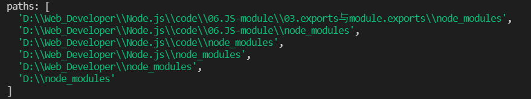
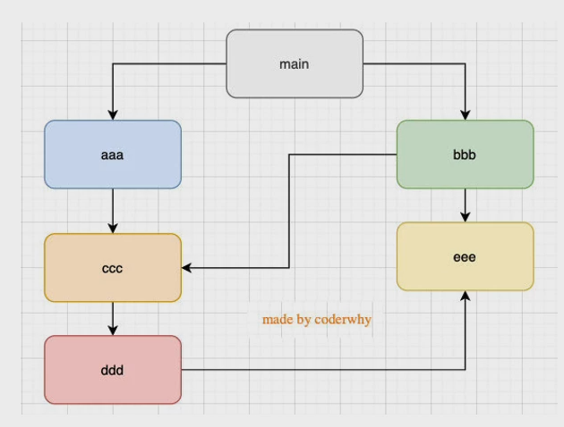

* ## 1.require查找文件的规则

  * 我们现在已经知道，require是一个函数，可以帮助我们引入一个文件（模块）中导入的对象。

  * 那么，require的查找规则是怎么样的呢?

    * 这里总结比较常见的查找规则:导入格式如下:require(X)
    * **情况一**:X是一个核心模块，比如path、http
      * 直接返回核心模块，并且停止查找
    * **情况二**:X是以./或../或/(根目录）开头的
      * **第一步:将X当做一个文件在对应的目录下查找**;

        * 1.如果有后缀名，按照后缀名的格式查找对应的文件
        * 2.如果没有后缀名，会按照如下顺序∶
          1. 直接查找文件X
          2. 查找X.js文件
          3. 查找X.json文件
          4. 查找X.node文件

      * **第二步:没有找到对应的文件，将X作为一个目录**

        * 查找目录下面的index文件

          1. 查找X/index.js文件
          2. 查找X/index.json文件

          3. 查找X/index.node文件如果没有找到，那么报错:not found

    * **情况三:直接是一个X(没有路径），并且X不是一个核心模块**
      * node会在node_modules中查找所安装的包是否存在X，在node安装的包都存在于node_modules中；
      * 例如当前js文件所在路径为`D:\\Web_Developer\\Node.js\\code\\06.JS-module\\03.exports与module.exports`,那么node就会在当前文件下查找node_modules，如果不存在则会跳到上一级查找，直到每一级目录都查找完毕，像下面的查找顺序一样；
      * 该截图为module对象的paths属性

  ## 2、引用模块加载的规则

  - **一:模块在被第一次引入时,模块中的js代码会被运行一次**
  - **二:模块被多次引入时，会缓存，最终只加载(运行）一次**
    - 为什么只会加载运行一次呢?
    - 这是因为每个模块对象module都有一个属性:loaded。为false表示还没有加载，为true表示已经加载;
    - 当一个aaa.js同时被两个js引用，而两个js文件都调用的话，只会执行一次被引用的js文件，第一次读取到require('./aaa');会加载该js文件,并把该js模块的loaded修改为true，当第二个文件读取到require('./aaa.js')时，检测到loaded为false，就不会再加载文件了。
  - **三:如果有循环引入，那么加载顺序是什么?**
  - 当存在上面的嵌套关系，node会采取**深度优先搜索算法**原则
  - 如果require('./aaa')在require('./bbb')前面执行顺序main->aaa->ccc->ddd->eee->bbb
  - 如果require('./bbb')在require('./aaa')前面执行顺序main->bbb->ccc->ddd->eee->aaa