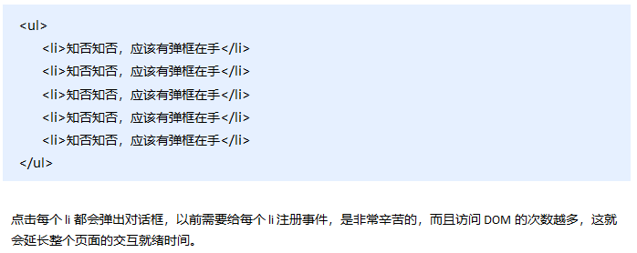

## DOM事件流

> **事件流描述的是从页面中接收事件的顺序。事件发生时会在元素节点之间按照特定的顺序传播，这个传播过程即DOM事件流。**比如：我们给页面中的一个div注册了单击事件，当你单击了div时，也就单击了body，单击了html，单击了document。

DOM 事件流会经历3个阶段： 

1. 捕获阶段

2. 当前目标阶段

3. 冒泡阶段 


**事件冒泡**

```js
    <div class="father">
        <div class="son">son盒子</div>
    </div>
    <script>
        // onclick 和 attachEvent（ie） 在冒泡阶段触发
        // 冒泡阶段 如果addEventListener 第三个参数是 false 或者 省略 
        // son -> father ->body -> html -> document
        var son = document.querySelector('.son');
		// 给son注册单击事件
        son.addEventListener('click', function() {
            alert('son');
        }, false);
		// 给father注册单击事件
        var father = document.querySelector('.father');
        father.addEventListener('click', function() {
            alert('father');
        }, false);
		// 给document注册单击事件，省略第3个参数
        document.addEventListener('click', function() {
            alert('document');
        })
    </script>
```

**事件捕获**

```js
    <div class="father">
        <div class="son">son盒子</div>
    </div>
    <script>
        // 如果addEventListener() 第三个参数是 true 那么在捕获阶段触发
        // document -> html -> body -> father -> son
         var son = document.querySelector('.son');
		// 给son注册单击事件，第3个参数为true
         son.addEventListener('click', function() {
             alert('son');
         }, true);
         var father = document.querySelector('.father');
		// 给father注册单击事件，第3个参数为true
         father.addEventListener('click', function() {
             alert('father');
         }, true);
		// 给document注册单击事件，第3个参数为true
        document.addEventListener('click', function() {
            alert('document');
        }, true)
    </script>
```

### 1.3.5. 事件对象

#### 什么是事件对象

事件发生后，跟事件相关的一系列信息数据的集合都放到这个对象里面，这个对象就是事件对象。

比如：  

1. 谁绑定了这个事件。

2. 鼠标触发事件的话，会得到鼠标的相关信息，如鼠标位置。

3. 键盘触发事件的话，会得到键盘的相关信息，如按了哪个键。

#### 事件对象的使用

事件触发发生时就会产生事件对象，并且系统会以实参的形式传给事件处理函数。

所以，在事件处理函数中声明1个形参用来接收事件对象。


#### 事件对象的属性和方法


#### e.target 和 this 的区别

-  this 是事件绑定的元素（绑定这个事件处理函数的元素） 。

-  e.target 是事件触发的元素。

> ```
> 常情况下terget 和 this是一致的，
> 但有一种情况不同，那就是在事件冒泡时（父子元素有相同事件，单击子元素，父元素的事件处理函数也会被触发执行），
> 	这时候this指向的是父元素，因为它是绑定事件的元素对象，
> 	而target指向的是子元素，因为他是触发事件的那个具体元素对象。
> ```

事件冒泡下的e.target和this

```js
    <ul>
        <li>abc</li>
        <li>abc</li>
        <li>abc</li>
    </ul>
    <script>
        var ul = document.querySelector('ul');
        ul.addEventListener('click', function(e) {
              // 我们给ul 绑定了事件  那么this 就指向ul  
              console.log(this); // ul
              // e.target 触发了事件的对象 我们点击的是li e.target 指向的就是li
              console.log(e.target); // li
        });
    </script>
```

### 1.3.6 阻止默认行为

> html中一些标签有默认行为，例如a标签被单击后，默认会进行页面跳转。

```js
    <a href="http://www.baidu.com">百度</a>
    <script>
        // 2. 阻止默认行为 让链接不跳转 
        var a = document.querySelector('a');
        a.addEventListener('click', function(e) {
             e.preventDefault(); //  dom 标准写法
        });
        // 3. 传统的注册方式
        a.onclick = function(e) {
            // 普通浏览器 e.preventDefault();  方法
            e.preventDefault();
            // 低版本浏览器 ie678  returnValue  属性
            e.returnValue = false;
            // 我们可以利用return false 也能阻止默认行为 没有兼容性问题
            return false;
        }
    </script>
```

### 1.3.7 阻止事件冒泡

事件冒泡本身的特性，会带来的坏处，也会带来的好处。


```js
    <div class="father">
        <div class="son">son儿子</div>
    </div>
    <script>
        var son = document.querySelector('.son');
		// 给son注册单击事件
        son.addEventListener('click', function(e) {
            alert('son');
            e.stopPropagation(); // stop 停止  Propagation 传播
            window.event.cancelBubble = true; // 非标准 cancel 取消 bubble 泡泡
        }, false);

        var father = document.querySelector('.father');
		// 给father注册单击事件
        father.addEventListener('click', function() {
            alert('father');
        }, false);
		// 给document注册单击事件
        document.addEventListener('click', function() {
            alert('document');
        })
    </script>
```

### 1.3.8 事件委托

事件冒泡本身的特性，会带来的坏处，也会带来的好处。

#### 什么是事件委托

```
把事情委托给别人，代为处理。
```

事件委托也称为事件代理，在 jQuery 里面称为事件委派。

> 说白了就是，不给子元素注册事件，给父元素注册事件，把处理代码在父元素的事件中执行。

**js事件中的代理：**



#### 事件委托的原理

​	给父元素注册事件，利用事件冒泡，当子元素的事件触发，会冒泡到父元素，然后去控制相应的子元素。

#### 事件委托的作用

- 我们只操作了一次 DOM ，提高了程序的性能。

- 动态新创建的子元素，也拥有事件。

```js
    <ul>
        <li>知否知否，点我应有弹框在手！</li>
        <li>知否知否，点我应有弹框在手！</li>
        <li>知否知否，点我应有弹框在手！</li>
        <li>知否知否，点我应有弹框在手！</li>
        <li>知否知否，点我应有弹框在手！</li>
    </ul>
    <script>
        // 事件委托的核心原理：给父节点添加侦听器， 利用事件冒泡影响每一个子节点
        var ul = document.querySelector('ul');
        ul.addEventListener('click', function(e) {
            // e.target 这个可以得到我们点击的对象
            e.target.style.backgroundColor = 'pink';
        })
    </script>
```

## 