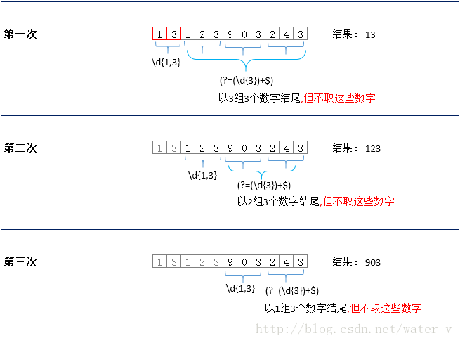
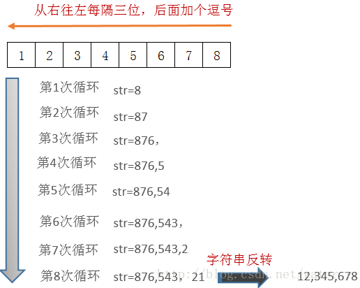

## 方法一：使用正则表达式

```js
function format (num) {  
    var reg = /\d{1,3}(?=(\d{3})+$)/g;   
    return (num + '').replace(reg, '$&,');  
}
```

解释

正则表达式\d{1,3}(?=(\d{3})+$)表示前面有1~3个数字，后面的至少由一组3个数字结尾

?=表示正向引用，可以作为匹配的条件，但匹配到的内容不获取，并且作为下一次查询的开始。

$&表示与正则表达式相匹配的内容，具体的使用可以查看字符串replace()方法的运行过程看下图

假如有数字13123903243，则正则表示式查找与替换的过程，如下图所示



## 第二种:方法-正常思维算法

```js
function format(num){  
 num = num+''; // 数字转字符串  
  var str = ""; // 字符串累加  
  for(var i = num.length- 1, j = 1; i >= 0; i--, j++){  
      if(j % 3 == 0 && i != 0){// 每隔三位加逗号，过滤正好在第一个数字的情况  
          str += num[i] + ",";// 加千分位逗号  
          continue;  
      }  
      str += num[i];// 倒着累加数字  
  }  
  return str.split('').reverse().join(""); // 字符串=>数组=>反转=>字符串  
}
```

**基本思路**
