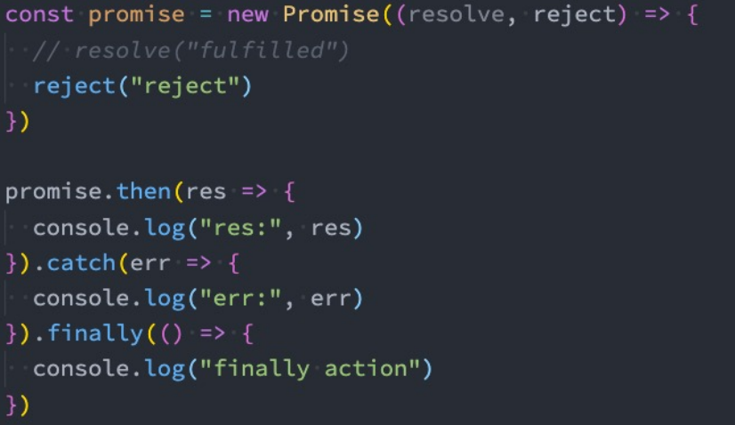
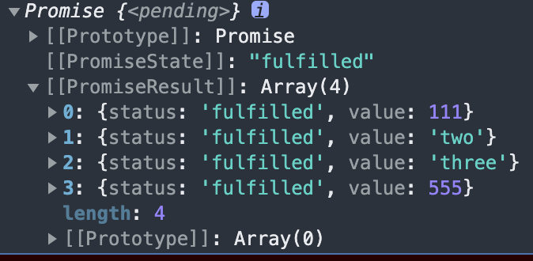

##  Promise构造函数: 

### **Promise (excutor){ }**

* **executor函数**:执行器(resolve,reject)=>{}
* **resolve函数**:内部定义成功时我们调用的函数value =>{}，**如果传入的value值为Promise则改Promis的状态依据传入的Promise**
* **reject 函数**:内部定义失败时我们调用的函数reason =>{}
* **说明: executor 会在 Promise 内部立即同步调用,异步操作在执行器中执行**

```js
const app = new Promise((resolve, reject) => {
   console.log("111");
})
console.log('222');//结果先打印111，后为222

const app = new Promise((resolve, reject) => {
    resolve(111);
}).then(data => {
    console.log(data);
})
console.log(222); // 结果先打印22，后为111

//结论：executor执行器会在 Promise 内部立即同步调用,异步操作在执行器中执行；
```

### **Promise.prototype.then**

* (onResolved, onRejected)=>{ }
  * (1)onResolved.函数:成功的回调函数(value)=>{ }
  * (2)onRejected.函数:失败的回调函数(reason)=> { }
  * 说明1:指定用于得到成功value的成功回调和用于得到失败reason的失败回调，**并返回一个新的promise对象**
    * **当传递的为非Promise对象，则返回的结果为成功的Promise对象** 
    * **当传递的为Promise对象，则返回的为对应Promise对象的状态** 
    * 使用throw，则返回一个失败的promise对象
    * **当promise状态没有改变不会调用then方法**
  * 说明2:then可以链式调用，只有在then中返回padding状态的promise才能终止链式调用。

### **Promise.prototype.catch()**

* 方法:(onRejected)=>{ }
  * onRejected函数：失败的回调函数(reason)=>{ } **只能执行失败的回调函数**
  * **catch的返回值与then的返回值一样的**，都会返回一个Promise对象。Promise对象的状态和then规则一致

### Prmoise.prototype.finally

* finally是在ES9（ES2018）中新增的一个特性：表示无论Promise对象无论变成fulfilled还是reject状态，最终都会被执行的代码。
* finally方法是不接收参数的，因为无论前面是fulfilled状态，还是reject状态，它都会执行<br> 

## Promise类方法

### Promise.resolve

**该方法属于Promise函数对象的，不属于实例对象**；可以返回一个成功或者失败的Promise对象

```js
  const p1 = Promise.resolve('111');
  console.log(p1);
  /* 
    [[Prototype]]: Promise
    [[PromiseState]]: "fulfilled"
    [[PromiseResult]]: "111"
  */

  const p2 = Promise.resolve(new Promise((resolve, reject) => {
    reject('error')
  }))
  p2.catch((props) => {
    console.log(props);
  })
  console.log(p2);
  /* 
  [[Prototype]]: Promise
  [[PromiseState]]: "rejected"
  [[PromiseResult]]: "error"
  */

  const p3 = Promise.resolve(new Promise((resolve, reject) => {
    resolve('correct')
  }))
  console.log(p3);
  /*
  [[Prototype]]: Promise
  [[PromiseState]]: "fulfilled"
  [[PromiseResult]]: "correct"
  */
 
  /*
   结论：当resolve的参数为非Promise对象，则返回的结果为成功的Promise对象
        当传递的为Promise对象，则返回的为对应Promise对象的状态
  */
```

### Promise.reject

该方法也是Promise函数方法，不是对象实例的方法；返回的Promise**永远为失败的，**传入什么就返回什么PromiseResult；

### Promise.all

Promise.all方法:(promises) => {}<br>promises:包含n个promise的数组
**说明:返回一个新的promise，只有所有的promise都成功才成功，只要有一个失败了就直接失败，无须等待所有promise执行完毕才返回，该方法主要是用于多个请求同时发送，等所有请求都收到了再进行处理。**

```js
const p1 = new Promise((reslove, reject) => {
  setTimeout(() => {
    return reslove(111)
  }, 500)
})
const p2 = Promise.resolve('two');
const p3 = Promise.resolve("three");
const p4 = Promise.reject("four");

const result1 = Promise.all([p1, p2, p3]);//PromiseResult为三个Promise成功PromiseResult的数组
const result2 = Promise.all([p1, p2, p3, p4]);//只包含reject的PromiseResult结果

console.log(result1); //结果如下图
console.log(result2);
 
/*--------------*/
const p1 = new Promise((reslove, reject) => {
  setTimeout(() => {
    return reslove(111)
  }, 500)
})

const p2 = new Promise((reslove, reject) => {
  setTimeout(() => {
    return reslove(222)
  }, 1000)
})

const p3 = new Promise((reslove, reject) => {
  setTimeout(() => {
    return reslove(333)
  }, 1500)
})

// 等待all中所有promise执行完毕才会返回一个新的Promise，由于也是返回promise，所以可以调用then方法
Promise.all([p1, p2, p3, 555]).then(res => {
  console.log(res);
})
```

两个结果的截图


### Promise.allSettled

* all方法有一个缺陷：**当有其中一个Promise变成reject状态时，新Promise就会立即变成对应的reject状态。** 

  * **那么对于resolved的，以及依然处于pending状态的Promise，我们是获取不到对应的结果的**；

* 在ES11（ES2020）中，添加了新的API `Promise.allSettled` 

  * 该方法会在所有的Promise都有结果（settled），无论是fulfilled，还是reject时，都会有最终的状态；
  * 并且**这个Promise的结果一定是fulfilled的**

* ```js
  const p1 = new Promise((reslove, reject) => {
    setTimeout(() => {
      return reslove(111)
    }, 500)
  })
  
  const p2 = new Promise((reslove, reject) => {
    setTimeout(() => {
      return reject(222)
    }, 1000)
  })
  
  const p3 = new Promise((reslove, reject) => {
    setTimeout(() => {
      return reslove(333)
    }, 1500)
  })
  
  Promise.allSettled([p1, p2, p3, 555]).then(res => {
    console.log(res);
  }).catch(err => {
    console.log(err);
  })
  ```

  allSettled的结果是一个数组，数组中存放着每一个Promise的结果，并且是对应一个对象的；这个对象中包含status状态，以及对应的value值；<br>

### Promise.race

Promise.race方法: (promises)=>{ }<br>promises:包含n个promise的数组
**说明:返回一个新的promise，第一个完成的promise的结果状态就是最终的结果状态，第一个成功则race就成功，反之就失败**

```js
const p1 = new Promise((resolve, reject) => {
    setTimeout(() => {
        resolve('one');
    }, 100)
})
const p2 = Promise.resolve('two');//最先完成
const p3 = Promise.resolve("three");

const result = Promise.race([p1, p2, p3]);//返回的结果为p2的结果
console.log(result);
```

结果截图<br>


### Promise.any

* **any方法会等到一个fulfilled状态，才会决定新Promise的状态；** 

* **如果所有的Promise都是reject的，那么也会等到所有的Promise都变成rejected状态；**

  

