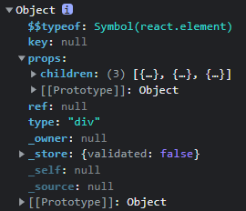

## 关于 JSX 的 3 个“大问题”

* **JSX 的本质是什么，它和 JS 之间到底是什么关系？**
* **为什么要用 JSX？不用会有什么后果？**
* **JSX 背后的功能模块是什么，这个功能模块都做了哪些事情？**


## 1.JSX 的本质

> react官网定义：**JSX 是 JavaScript 的一种语法扩展，它和模板语言很接近，但是它充分具备 JavaScript 的能力。**

### 1.1JSX 如何在 JavaScript 中生效的

* Facebook 公司给 **JSX 的定位是 JavaScript 的“扩展”，而非 JavaScript 的“某个版本”，这就直接决定了浏览器并不会像天然支持 JavaScript 一样地支持 JSX。**那么，JSX 的语法是如何在 JavaScript 中生效的呢？

  * JSX 会被编译为` React.createElement()`，` React.createElement() `将返回一个叫作“React Element”的 JS 对象。
  * 而JSX编译为React.createRlement()是由**Bable完成的**

  #### **babel是什么？**

  >Babel 是一个工具链，主要用于将 ECMAScript 2015+ 版本的代码转换为向后兼容的 JavaScript 语法，以便能够运行在当前和旧版本的浏览器或其他环境中。—— Babel 官网

  **而Babel 也具备将 JSX 语法转换为 JavaScript 代码的能力**

  

  #### **用babel将JXS语法转化为React.createElement()**

  ```jsx
  //JSX语法
  <div>
      <div className="header">
          <h2 title="标题">title</h2>
      </div>
      <div className='content'>
          <h2>这是一段类容</h2>
          <button>按钮</button>
          <a href="www.baidu.com">百度</a>
      </div>
      <div className='footer'>
          <p>尾部类容</p>
      </div>
  </div>
  
  //对应的React.createElement()语法
  /*useCreateElement接收三个参数,第一个为节点类型，第二个为节点属性，第三个为节点里面的内容*/
  const useCreateElement =
      React.createElement("div", null,
          React.createElement("div", { className: "header" },
              React.createElement("h2", { title: "\u6807\u9898" }, "title")
          ),
          React.createElement("div", { className: "content" },
              React.createElement("h2", null, "\u8FD9\u662F\u4E00\u6BB5\u7C7B\u5BB9"),
              React.createElement("button", null, "\u6309\u94AE"),
              React.createElement("a", { href: "www.baidu.com" }, "\u767E\u5EA6")
          ),
          React.createElement("div", { className: "footer" },
              React.createElement("p", null, "\u5C3E\u90E8\u7C7B\u5BB9")
          )
      );
  /* 
  打印useCreateElement对象，里面有props对象，该对象存放着children数组，
  该数组正好为3个div，然后三个div里面的children数组里面再存放对应自己的内容标签 
  正好对应了DOM结构，这个称为虚拟DOM，然后经过React.render渲染为HTML可显示的DOM树结构
  */
  ```

  > **所以JSX 的本质是React.createElement这个 JavaScript 调用的语法糖**

---


## 2.JSX 是如何映射为 DOM 

### 2.1.createElement

```js
/**
 React的创建元素方法
 */
export function createElement(type, config, children) {
  // propName 变量用于储存后面需要用到的元素属性
  let propName; 
  // props 变量用于储存元素属性的键值对集合
  const props = {}; 
  // key、ref、self、source 均为 React 元素的属性，此处不必深究
  let key = null;
  let ref = null; 
  let self = null; 
  let source = null; 

  // config 对象中存储的是元素的属性
  if (config != null) { 
    // 进来之后做的第一件事，是依次对 ref、key、self 和 source 属性赋值
    if (hasValidRef(config)) {
      ref = config.ref;
    }
    // 此处将 key 值字符串化
    if (hasValidKey(config)) {
      key = '' + config.key; 
    }
    self = config.__self === undefined ? null : config.__self;
    source = config.__source === undefined ? null : config.__source;
      
    // 接着就是要把 config 里面的属性都一个一个挪到 props 这个之前声明好的对象里面
    for (propName in config) {
      if (
        // 筛选出可以提进 props 对象里的属性
        hasOwnProperty.call(config, propName) &&
        !RESERVED_PROPS.hasOwnProperty(propName) 
      ) {
        props[propName] = config[propName]; 
      }
    }
  }
    
  // childrenLength 指的是当前元素的子元素的个数，减去的 2 是 type 和 config 两个参数占用的长度
  const childrenLength = arguments.length - 2; 
  // 如果抛去type和config，就只剩下一个参数，一般意味着文本节点出现了
  if (childrenLength === 1) { 
    // 直接把这个参数的值赋给props.children
    props.children = children; 
    // 处理嵌套多个子元素的情况
  } else if (childrenLength > 1) { 
    // 声明一个子元素数组
    const childArray = Array(childrenLength); 
    // 把子元素推进数组里
    for (let i = 0; i < childrenLength; i++) { 
      childArray[i] = arguments[i + 2];
    }
    // 最后把这个数组赋值给props.children
    props.children = childArray; 
  } 
    
  // 处理 defaultProps
  if (type && type.defaultProps) {
    const defaultProps = type.defaultProps;
    for (propName in defaultProps) { 
      if (props[propName] === undefined) {
        props[propName] = defaultProps[propName];
      }
    }
  }

  // 最后返回一个调用ReactElement执行方法，并传入刚才处理过的参数
  return ReactElement(
    type,
    key,
    ref,
    self,
    source,
    ReactCurrentOwner.current,
    props,
  );
}

```

**createElement 函数体拆解**

<br>

>**说得更直白点，createElement 就像是开发者和 ReactElement 调用之间的一个“转换器”、一个数据处理层。它可以从开发者处接受相对简单的参数，然后将这些参数按照 ReactElement 的预期做一层格式化，最终通过调用 ReactElement 来实现元素的创建。整个过程如下图所示：**<br>

---


### 2.2.ReactElement 

**createElement 执行到最后会 return 一个针对 ReactElement 的调用。下面是 ReactElement，源码 + 注释形式的解析：**

```js
  const ReactElement = function (type, key, ref, self, source, owner, props) {
    const element = {
      // REACT_ELEMENT_TYPE是一个常量，用来标识该对象是一个ReactElement
      $$typeof: REACT_ELEMENT_TYPE,
      // 内置属性赋值
      type: type,
      key: key,
      ref: ref,
      props: props,
      // 记录创造该元素的组件
      _owner: owner,
    };

    // 
    if (__DEV__) {
      // 这里是一些针对 __DEV__ 环境下的处理，对于理解主要逻辑意义不大，此处直接省略掉，以免混淆视听
    }

    return element;
  };
```

> **从逻辑上我们可以看出，ReactElement 其实只做了一件事情，那就是“创建”，说得更精确一点，是“组装”：ReactElement 把传入的参数按照一定的规范，“组装”进了 element 对象里，并把它返回给了 React.createElement，最终React.createElement 又把它交回到了开发者手中。**<br>

---


### **2.3.ReactDOM.render**

打印上面使用createElement创建的实例<br>

> 这个 ReactElement 对象实例，本质上是**以 JavaScript 对象形式存在的对 DOM 的描述**，也就是老生常谈的“虚拟 DOM”（**准确地说，是虚拟 DOM 中的一个节点**。既然是“虚拟 DOM”，那就意味着和渲染到页面上的真实 DOM 之间还有一些距离，这个“距离”，就是由大家喜闻乐见的**ReactDOM.render**方法来填补的。

```js
ReactDOM.render(
    // 需要渲染的元素（ReactElement）
    element, 
    // 元素挂载的目标容器（一个真实DOM）
    container,
    // 回调函数，可选参数，可以用来处理渲染结束后的逻辑
    [callback]
)
```

> ReactDOM.render 方法可以接收 3 个参数，其中**第二个参数就是一个真实的 DOM 节点**，**这个真实的 DOM 节点充当“容器”的角色**，React 元素最终会被渲染到这个“容器”里面去。比如，示例中的 App 组件，它对应的 render 调用是这样的：

```js
const rootElement = document.getElementById("root");
ReactDOM.render(<App />, rootElement);
```

> 注意，**这个真实 DOM 一定是确实存在的**。比如，在 App 组件对应的 index.html 中，已经提前预置 了 id 为 root 的根节点：

