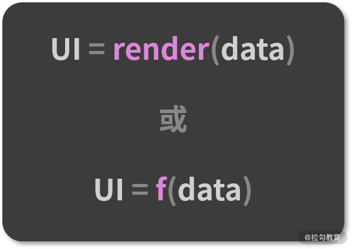

## React驱动视图



这个表达式有很多的版本，一些版本会把入参里的 data 替换成 state，但它们本质上都指向同一个含义，那就是**React的视图会随着数据的变化而变化。**

## props

> props 是组件的入参，那么组件之间通过修改对方的入参来完成数据通信就是天经地义的事情了。不过，这个“修改”也是有原则的——你必须确保所有操作都在“**单向数据流**”这个前提下。**所谓单向数据流，指的就是当前组件的 state 以 props 的形式流动时，只能流向组件树中比自己层级更低的组件。** 比如在父-子组件这种嵌套关系中，只能由父组件传 props 给子组件，而不能反过来。
>

**props不适合复杂的通信**，例如<br>

**A 组件倘若想要和层层相隔的 E 组件实现通信，就必须把 props 经过 B、C、D 一层一层地传递下去。在这个过程中，反反复复的 props 传递不仅会带来庞大的工作量和代码量，还会污染中间无辜的 B、C、D 组件的属性结构。短期来看，写代码的人会很痛苦；长期来看，整个项目的维护成本都会变得非常高昂。**

---


## 利用“发布-订阅”模式驱动数据流

* **使用发布-订阅模式的优点**

  * **监听事件的位置和触发事件的位置是不受限的**，就算相隔十万八千里，只要它们在同一个上下文里，就能够彼此感知。

* **发布-订阅模型 API 设计思路**

  * 通过前面的讲解，不难看出发布-订阅模式中有两个关键的动作：事件的监听（订阅）和事件的触发（发布），这两个动作自然而然地对应着两个基本的 API 方法。
  * **on()**：负责注册事件的监听器，指定事件触发时的回调函数。
  * **emit()**：负责触发事件，可以通过传参使其在触发的时候携带数据 。
  * **off()**：负责监听器的删除。

* **发布-订阅模型编码实现**

  ```js
  class myEventEmitter {
    constructor() {
      // eventMap 用来存储事件和监听函数之间的关系
      this.eventMap = {};
    }
      
    // type 这里就代表事件的名称
    on(type, handler) {
      // hanlder 必须是一个函数，如果不是直接报错
      if (!(handler instanceof Function)) {
        throw new Error("哥 你错了 请传一个函数");
      }
      // 判断 type 事件对应的队列是否存在
      if (!this.eventMap[type]) {
        // 若不存在，新建该队列
        this.eventMap[type] = [];
      }
      // 若存在，直接往队列里推入 handler
      this.eventMap[type].push(handler);
    }
      
    // 别忘了我们前面说过触发时是可以携带数据的，params 就是数据的载体
    emit(type, params) {
      // 假设该事件是有订阅的（对应的事件队列存在）
      if (this.eventMap[type]) {
        // 将事件队列里的 handler 依次执行出队
        this.eventMap[type].forEach((handler, index) => {
          // 注意别忘了读取 params
          handler(params);
        });
      }
    }
      
    off(type, handler) {
      if (this.eventMap[type]) {
        this.eventMap[type].splice(this.eventMap[type].indexOf(handler) >>> 0, 1);
      }
    }
  }
  
  ```


---


## Context API

>  **Context API 有 3 个关键的要素：React.createContext、Provider、Consumer。**


**Cosumer 不仅能够读取到 Provider 下发的数据，**还能读取到这些数据后续的更新**。这意味着数据在生产者和消费者之间能够及时同步，这对 Context 这种模式来说至关重要。**

### **缺点**

> **在react里，context是个反模式的东西，不同于redux等的细粒度响应式更新，context的值一旦变化，所有依赖该context的组件全部都会`force update`，因为context API并不能细粒度地分析某个组件依赖了context里的哪个属性，并且它可以穿透`React.memo`和`shouldComponentUpdate`的对比，把所有涉事组件强制刷新。**

React官方文档在 [When to Use Context](https://link.juejin.cn/?target=https%3A%2F%2Freactjs.org%2Fdocs%2Fcontext.html%23when-to-use-context) 一节中写道：

> **Context 设计目的是为了共享那些对于一个组件树而言是“全局”的数据，例如当前认证的用户、主题或首选语言。**


