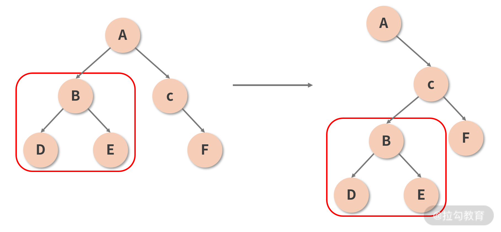
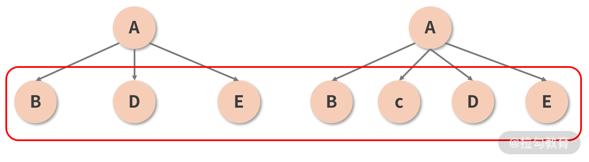
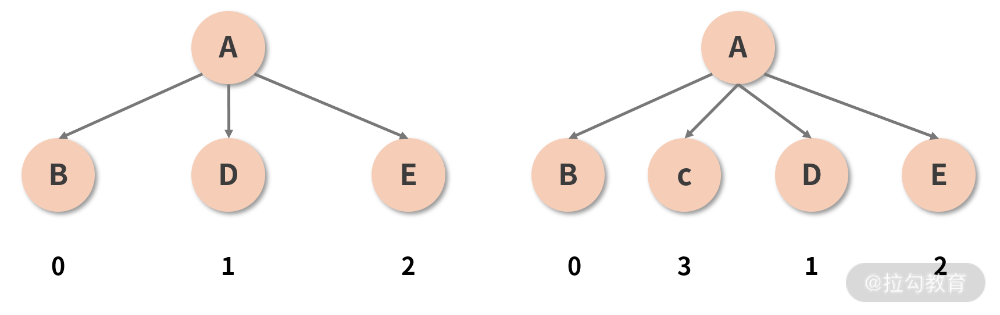

## 调和（Reconciliation）过程与 Diff 算法

“调和”又译为“协调”，协调过程的官方定义，藏在 React 官网对虚拟 DOM 这一概念的解释中，原文如下：

>Virtual DOM 是一种编程概念。在这个概念里，UI 以一种理想化的，或者说“虚拟的”表现形式被保存于内存中，并通过如 ReactDOM 等类库使之与“真实的” DOM 同步。这一过程叫作协调（调和）。

**通过如 ReactDOM 等类库使虚拟 DOM 与“真实的” DOM 同步，这一过程叫作协调（调和）。**

调和指的是将虚拟 DOM映射到真实 DOM 的过程。因此严格来说，**调和过程并不能和 Diff 画等号。调和是“使一致”的过程，而 Diff 是“找不同”的过程，它只是“使一致”过程中的一个环节。**React 的源码结构佐证了这一点：React 从大的板块上将源码划分为了 **Core、Renderer 和 Reconciler** 三部分。其中 **Reconciler（调和器）**的源码位于src/renderers/shared/stack/reconciler这个路径，**调和器所做的工作是一系列的，包括组件的挂载、卸载、更新等过程，其中更新过程涉及对 Diff 算法的调用。**

## Diff 策略的设计思想

Diff 算法其实就是“找不同”的过程。在计算机科学领域，要想找出两个树结构之间的不同, 传统的计算方法是通过循环递归进行树节点的一一对比,  这个过程的算法复杂度是 O (n3) 。尽管这个算法本身已经是几代程序员持续优化的结果，但对计算能力有限的浏览器来说，O (n3) 仍然意味着一场性能灾难。
React 团队结合设计层面的一些推导，总结了以下两个规律， 为将 O (n3) 复杂度转换成 O (n) 复杂度确立了大前提：

* Diff 算法性能突破的关键点在于“分层对比”；
* 类型一致的节点才有继续 Diff 的必要性；
* key 属性的设置，可以帮我们尽可能重用同一层级内的节点。

### 1. 改变时间复杂度量级的决定性思路：分层对比

结合“DOM 节点之间的跨层级操作并不多，**同层级操作是主流**”这一规律，React 的 Diff 过程直接放弃了跨层级的节点比较，它**只针对相同层级的节点作对比**，如下图所示。这样一来，只需要从上到下的一次遍历，就可以完成对整棵树的对比，这是降低复杂度量级方面的一个最重要的设计。

> 需要注意的是：虽然栈调和将传统的树对比算法优化为了分层对比，但**整个算法仍然是以递归的形式运转的，分层递归也是递归**。

> 那么如果真的发生了跨层级的节点操作（比如将以 B 节点为根节点的子树从 A 节点下面移动到 C 节点下面，如下图所示）会怎样呢？很遗憾，作为“次要矛盾”，在这种情况下 React 并不能够判断出“移动”这个行为，**它只能机械地认为移出子树那一层的组件消失了，对应子树需要被销毁；而移入子树的那一层新增了一个组件，需要重新为其创建一棵子树。 **

**销毁 + 重建的代价是昂贵的，因此 React 官方也建议开发者不要做跨层级的操作，尽量保持 DOM 结构的稳定性。**

### 2. 减少递归的“一刀切”策略：类型的一致性决定递归的必要性

本着抓“主要矛盾”的基本原则，React 认为，只有同类型的组件，才有进一步对比的必要性**；若参与 Diff 的两个组件类型不同，那么直接放弃比较，原地替换掉旧的节点**，如下图所示。只有确认组件类型相同后，React 才会在保留组件对应 DOM 树（或子树）的基础上，尝试向更深层次去 Diff。

这样一来，便能够从很大程度上减少 Diff 过程中冗余的递归操作。

### 3. 重用节点的好帮手：key 属性帮 React “记住”节点

“key 属性能够帮助维持节点的稳定性”，这个结论从何而来呢？首先，我们来看看 React 对 key 属性的定义

>key 是用来帮助 React 识别哪些内容被更改、添加或者删除。key 需要写在用数组渲染出来的元素内部，并且需要赋予其一个稳定的值。稳定在这里很重要，因为如果 key 值发生了变更，React 则会触发 UI 的重渲染。这是一个非常有用的特性。

它试图解决的是**同一层级下节点的重用问题**。在展开分析之前，我们先结合到现在为止对 Diff 过程的理解，来思考这样一种情况，如下图所示： 

* 图中 A 组件在保持类型和其他属性均不变的情况下，在两个子节点（B 和 D）之间插入了一个新的节点（C）。按照已知的 Diff 原则，两棵树之间的 Diff 过程应该是这样的：
  * 首先对比位于第 1 层的节点，发现两棵树的节点类型是一致的（都是 A），于是进一步 Diff；
  * 开始对比位于第 2 层的节点，第 1 个接受比较的是 B 这个位置，对比下来发现两棵树这个位置上的节点都是 B，没毛病，放过它；
  * 第 2 个接受比较的是 D 这个位置，对比 D 和 C，发现前后的类型不一致，**直接删掉 D 重建 C**；
  * 第 3 个接受比较的是 E 这个位置，对比 E 和 D，发现前后的类型不一致，**直接删掉 E 重建 D**；
  * 最后接受“比较”的是树 2 的 E 节点这个位置，这个位置在树 1 里是空的，也就是说树 2 的E 是一个新增节点，所以新增一个 E。

你看你看，奇怪的事情发生了：C、D、E 三个节点，其实都是可以直接拿来用的。**原本新增 1 个节点就能搞定的事情，现在却又是删除又是重建地搞了半天**，这也太蠢了吧？**而且这个蠢操作和跨层级移动节点还不太一样，后者本来就属于低频操作，加以合理的最佳实践约束一下基本上可以完全规避掉；但图示的这种插入节点的形式，可是实打实的高频操作，你怎么躲也躲不过的**。频繁增删节点必定拖垮性能，这时候就需要请出 key 属性来帮我们重用节点了。

事实上，当我们没有设定 key 值的时候，Diff 的过程就正如上文所描述的一样惨烈。但只要你按照规范加装一个合适的 key，这个 key 就会像一个记号一样，帮助 React “记住”某一个节点，从而在后续的更新中实现对这个节点的追踪。比如说刚刚那棵虚拟 DOM 树，若我们给位于第 2 层的每一个子节点一个 key 值，如下图所示： 

这个 key 就充当了每个节点的 ID（唯一标识），有了这个标识之后，当 C 被插入到 B 和 D 之间时，React 并不会再认为 C、D、E 这三个坑位都需要被重建——它会通过识别 ID，意识到 D 和 E 并没有发生变化（D 的 ID 仍然是 1，E 的 ID 仍然是 2），而只是被调整了顺序而已。接着，React 便能够轻松地重用它“追踪”到旧的节点，将 D 和 E 转移到新的位置，并完成对 C 的插入。这样一来，同层级下元素的操作成本便大大降低。

## 总结

1. 栈调和就是将虚拟DOM映射到真实DOM的过程
2. 调和 !== diff, diff 只是调和过程的一个步骤
3. diff的理解:">diff算法就是找两个树的不同，差量更新，并将时间复杂度从n的3次方降为n，只要实现可以分为以下几点：
   1. 分层处理：分层处理是关键点，同层级才会进行比较，跨层级的直接跳过diff，销毁旧的，重建新的
   2. 类型相同的节点才有diff的必要性：类型不同直接原地替换旧的
   3. key属性：key作为唯一标识，可以减少同一层级的节点的不必要比较

