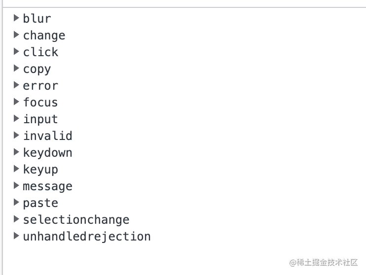
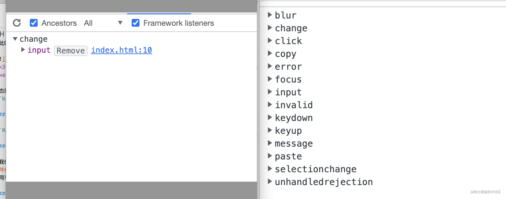

## react事件

* **react事件是绑定在document上的；**
* react的事件**对象是合成的**，不是原生的；
* react在底层，主要对合成事件做了2件事：
  * **事件委派**：把所有事件绑定到结构的最外层，使用统一的事件监听，这个事件监听器上维持了一个映射来保存所有组件内部事件监听和处理函数。
  * **自动绑定**： React组件中，每个方法的上下文都会指向该组件的实例，即自动绑定this为当前组件。
  * **优点**：几乎所有的事件都代理（delegate）到document，**达到性能优化的目的兼容所有浏览器，更好的跨平台**。方便 react 统一管理和事务机制。

## 原生事件

* **原生事件时绑定在DOM上的；**

* dom上的事件要优先于document上的事件执行。
* 事件的执行顺序为原生事件先执行，合成事件后执行，合成事件会冒泡绑定到 document 上，所以尽量避免原生事件与合成事件混用
* 如果原生事件阻止冒泡，可能会导致合成事件不执行，因为需要冒泡到 document 上合成事件才会执行。


## 什么是合成事件？

**合成事件（SyntheticEvent）**：是`React`**模拟**原生 DOM 事件所有能力的一个事件对象，即浏览器原生事件的跨浏览器包装器

简单的来讲，使用`onClick`点击事件，而`onClick`并不是**原生事件**，而是由原生事件合成的`React`事件

为了更好的理解，我们来看看`input`的`onChang`事件

```js
export default function App(props) {
  return (
    <div>
      <input onChange={(e) => console.log(e)}></input>
    </div>
  );
}
```

此时在`doncument`上的事件为<br>

也就是说，我们绑定的`onChange`事件最终被处理成了很多事件的监听器，如：`blur`、`change`、`focus`、`input`等

## 为什么要单独整一套呢？

`React`为什么要采取`事件合成`的模式呢？这样做有什么好处呢？

### 兼容性，跨平台

我们知道有多种浏览器，每个浏览器的内核都不相同，而`React`通过**顶层事件代理机制**，保证冒泡的统一性，抹平不同浏览器事件对象之间的差异，将不同平台的事件进行模拟成合成事件，使其能够跨浏览器执行

### 将所有事件统一管理

在原生事件中，所有的事件都绑定在对应的`Dom`上，如果页面复杂，绑定的事件会非常多，这样就会造成一些不可控的问题
而`React`将所有的事件都放在了`document`上，这样就可以对事件进行`统一管理`，从而避免一些不必要的麻烦

### 避免垃圾回收

我们来看看`React`和`原生事件`中的`input`都绑定`onChange`事件是什么样子？

可以看出，原生事件绑定`onchange`对应的就是`change`，而`React`会被处理为很多的监听器

在实际中，我们的事件会被频繁的创建和回收，这样会影响其性能，为了解决这个问题，`React`引入**事件池**，通过事件池来获取和释放事件。

也就是说，所有的**事件并不会被释放，而是存入到一个数组中，如果这个事件触发，则直接在这个数组中弹出即可，这样就避免了频繁创建和销毁**