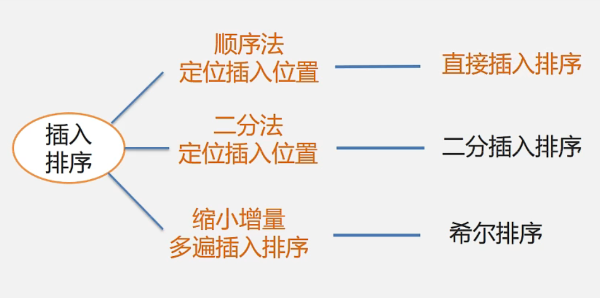

## 直接插入排序

### 思想：

在有序序列中插入一个元素，保持序列有序，有序长度不断增加。起初，a[0]是长度为1的子序列。然后，逐一将a[1]至a[n- 1]插入到有序子序列中。

**时间复杂度：**

* 原始数据越接近有序，排序速度越快
  * 最坏情况下(输入数据是逆有序的) Tw(n)=O(n2)
  * 平均情况下，耗时差不多是最坏情况的一半 Te(n)=O(n2)

## [希尔排序](https://www.bilibili.com/video/BV1nJ411V7bd?p=162&spm_id_from=pageDriver&vd_source=b6001cd2cca6a6d248ae56c4519c732f)

