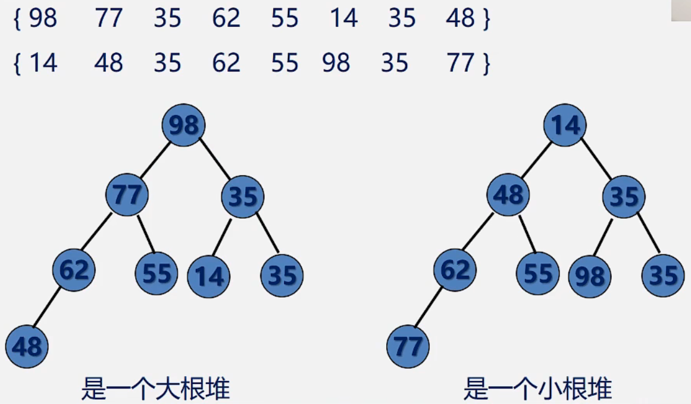

## 什么是堆

* **定义：**
  * **堆是一棵完全二叉树，树中每个结点的值都不小于（或不大于）其左右孩子的值。**
  * 如果父亲结点是大于等于左右孩子就是**大顶堆**，小于等于左右孩子就是**小顶堆**。
  * 左边为大顶堆，右边为小顶堆。

## 堆排序

**若在输出堆顶的最小值(最大值)后，使得剩余n-1个元素的序列重又建成一个堆，则得到n个元素的次小值(次大值) ... .如此反复，便能得到一个有序序列，这个过程称之为堆排序。**

**时间复杂度：**O(n * log2n)，n 是输出对顶元素需要n，其中有n - 1次需要将最后一个叶子结点放到对顶，然后交换到叶子结点这个过程的时间复杂度是O(log2n)；总的就是 O(n * log2n)

## 构建堆

以小根堆位例

* 对于一个无须列表先构建为一个完全二叉树

* **由于单结点的二叉树是堆，所以在完全二叉树中所有以叶子结点(序号i > n/2)为根的子树是堆。**

* 所以只需依次将以序号为n/2，n/2- 1, ..... 1的结点为根的子树均调整为堆即可。

* 从第n / 2结点开始，筛选左右较小的结点与当前结点交换，那么以n / 2为结点的子树已经是堆了，同理n - 1 / 2位置到堆顶都是这样交换的，注意：**交换的过程需要循环比较，当大的元素换下来了之后还需要继续比较左右子结点的大小。**

* [视频讲解](https://www.bilibili.com/video/BV1nJ411V7bd?p=169&spm_id_from=pageDriver&vd_source=b6001cd2cca6a6d248ae56c4519c732f)

  

## 输出对顶堆顶元素如何调整为新的堆

* 以小顶堆为列
  * 输出堆顶元素之后，**以堆中最后一个元素（编号最大的）替代之;**
  * 然后将根结点值与左、右子树的根结点值进行比较，并**与其中小者进行交换;**
  * 重复上述操作，直至叶子结点，将得到新的堆，称这个从堆顶至叶子的调整过程为"筛选”。
  * [视频讲解](https://www.bilibili.com/video/BV1nJ411V7bd?p=168&spm_id_from=pageDriver&vd_source=b6001cd2cca6a6d248ae56c4519c732f)

