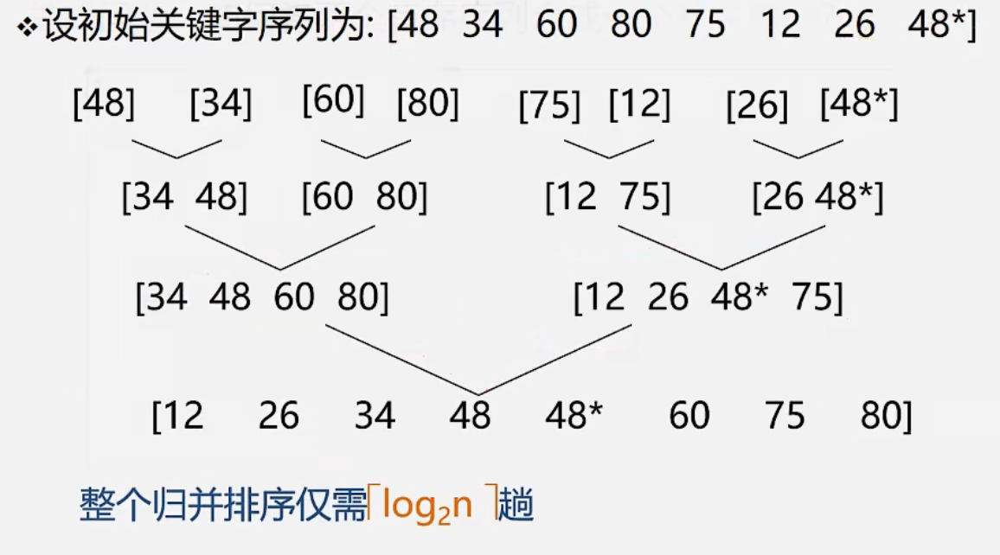

## 归并排序

* **思想**
  * 将两个或两个以上的有序子序列"归并”为一个有序子列。
  * 在内部排序中，通常采用的是2-路归并排序。
    即:将两个位置相邻的有序子序列RL[.m]和R[m+1..n]归并为一
    个有序序列R[..n]
* **过程**
  * 
  * [视频](https://www.bilibili.com/video/BV1nJ411V7bd?p=171&spm_id_from=pageDriver&vd_source=b6001cd2cca6a6d248ae56c4519c732f)
* **时间复杂度：**O(n*logn)，n是将相邻得到序列排序为一个有序的序列的时间复杂度，总共需要log2n
* **空间复杂度：**O(n)

