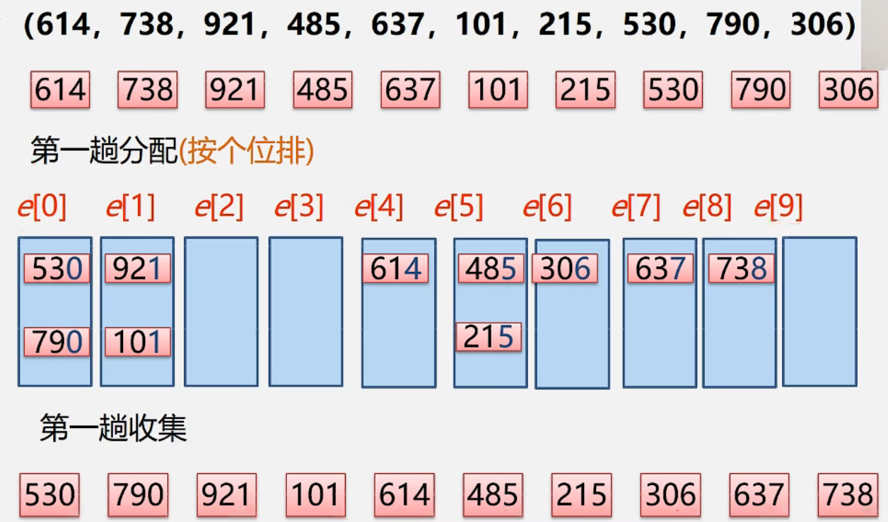
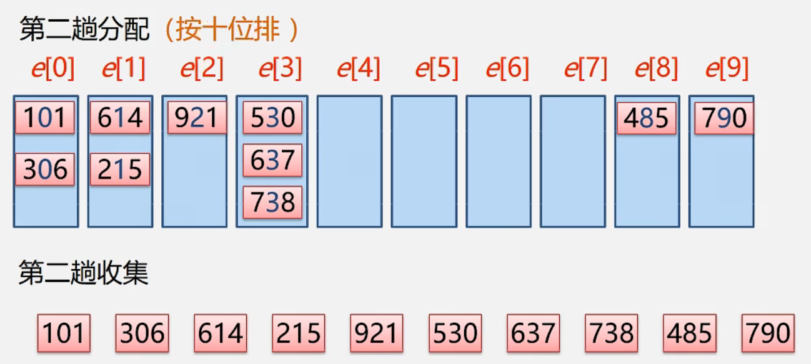
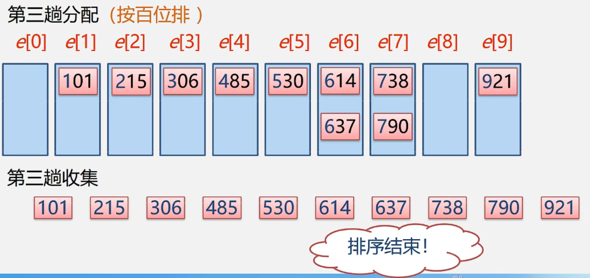

## 基数排序

* **思想**
  * 分配+收集
  * 也叫**桶排序**或**箱排序**:设置若干个箱子，将关键字为k的记录放入第k个箱子，然后在按序号将非空的连接。
  * 基数排序数字是有范围的，均由0-9这十个数字组成，则只需设置十个箱子，相继按个、十、百..进行排序.
* **复杂度**
  * 时间：O(k * (n + m))，k 是关键字个数 ，m是关键字取值范围
  * 空间：O(n + m)
* **过程**
  *  
  *  
  *  

