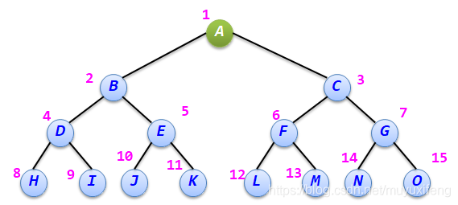
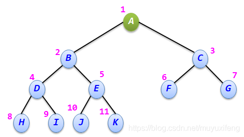

## 二叉搜索树

* **定义：**
  * 一棵二叉树，可以为空；如果不为空，满足以下性质：
  * 非空**左子树的所有键值小于其根结点的键值**。
  * 非空**右子树的所有键值大于其根结点的键值**。
  * **左、右子树都是二叉搜索树**。
* **特点：**
  * 最大元素一定是在树的最右分枝的端结点上。
  * 最小元素一定是在树的最左分枝的端结点上。

## 满二叉树

* **定义**
  * 在一棵二叉树中，如果所有分支结点都有左、右孩子结点，并且[叶子结点](https://so.csdn.net/so/search?q=叶子结点&spm=1001.2101.3001.7020)都集中在二叉树的最下层，这样的二叉树称为**满二叉树**。
  * 用户可以对满二叉树的结点进行层序编号，约定编号从树根为1开始，按照层数从小到大、同一层从左到右的次序进行，图中每个结点旁的数字为对该结点的编号。
  * 满二叉树也可以从结点个数和树的高度之间的关系来定义，即**一棵高度为h且有2h-1个结点的二叉树称为满二叉树。** 
* **特点**
  * **叶子结点都在最下一层**
  * **只有度为0和度为2的结点**，（结点拥有的子树称为度）
  * **含n个结点的满二叉树的高度为log2(n+1)**，**叶子结点个数为 n / 2 + 1**

## 完全二叉树

* **定义**
  * 若二叉树中最多只有最下面两层的结点的度可以小于2，并且最下面一层的叶子结点都依次排列在该层最左边的位置上，则这样的二叉树称为完全二叉树。如下图所示为一棵完全二叉树。
  * 同样可以对完全二叉树中的每个结点进行层序编号，编号的方法与满二叉树相同，图中每个结点旁的数字为该结点的编号。 
  * 满二叉树是完全二叉树的一种特例，并且完全二叉树与同高度的满二叉树对应结点的层序编号相同。上图所示的完全二叉树与等高度的满二叉树相比，它在最后一层的右边缺少了4个结点。
* **特点**
  * **叶子结点只可能出现在最下面两层中。**
  * **最下一层中的叶子结点都依次排列在该层最左边的位置上**
  * **如果有度为1的结点，只可能有一个，且该结点最多只有左孩子而无右孩子**
  * **按层序编号后，一旦出现某结点（其编号为i）为叶子结点或只有左孩子，则编号大于i的结点均为叶子结点。**
  * **具有n个（n>0）结点的完全二叉树的高度为⌈log2(n+1)⌉或⌊log2 n⌋+1=0**
  * **最后一个非叶子结点的位置在第 n / 2 的位置。**

## 大顶堆、小顶堆

* **定义：**
  * **堆是一棵完全二叉树，树中每个结点的值都不小于（或不大于）其左右孩子的值。**
  * 如果父亲结点是大于等于左右孩子就是**大顶堆**，小于等于左右孩子就是**小顶堆**。

