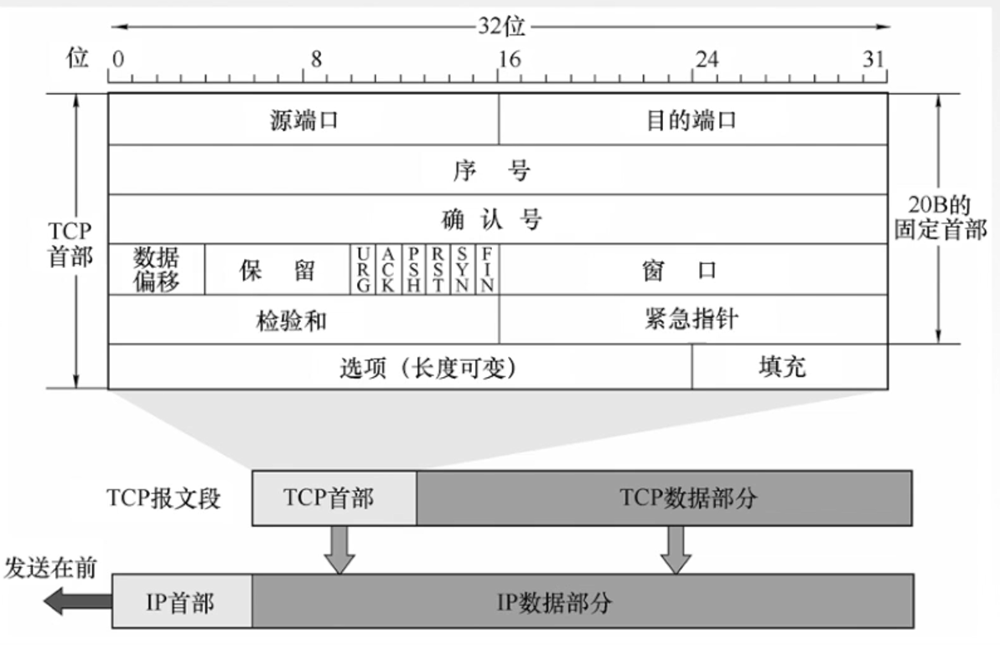
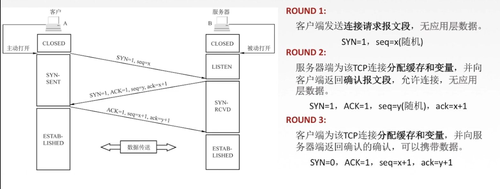
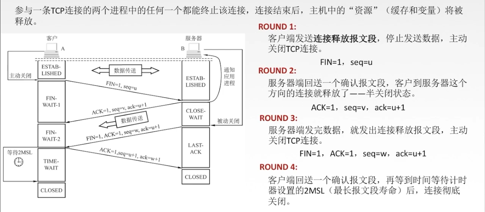

## 传输层

### 传输层的功能

1. **传输层提供进程与进程之间的通信。**

   如何理解:网络层是为主机与主机之间进行通信，那么当数据到达网络层时，只是数据进入到了主机，并没有进入到应用进程里面，才能实现通信。而网络层就是连接主机与进程之间的通信的，所以说**传输层提供进程与进程之间的通信**。
   
2. **复用和分用**

   1. **复用**：**应用层所有的应用进程都可以通过传输层再传输到网络层。**两个进程A与进程B的消息发送出去，会将两个进程的数据进行同一个传输单元进行传递，这就是**复用**。
   2. **分用：**  **传输层从网络层收到数据后交付指明的应用进程** ，另一台接收的主机需要将接收到的消息（报文段）传输给对应的进程，这就是分用。

3. **传输层会对报文进行差错检错**

4. **传输层的两种协议**：TCP、UDP

---

### TCP与UDP对比

* **TCP:**	面向连接的传输协议TCP
  * 传输数据之前必须建立连接，数据传送结束后要释放连接。由于TCP要提供可靠的面向连接的传输服务，因此不可避免增加了许多开销：确认、流量控制、计时器、定时器及连接管理。
* **UDP:**  无连接的数据报协议UDP
  * 传输数据之前不需要建立连接，收到UDP报文之后也不需要给出任何的确认。
* **总结：**
  * TCP是可靠，面向连接，时延大，适用于大文件
  * UDP不可靠，无连接，时延小，使用与小文件

---

### TCP

#### TCP的特点

1. **TCP是面向连接**（虚连接)的传输层协议。
2. **TCP面向字节流**。=>TCP把应用程序交下来的数据看成仅仅是一连串的无结构的字节流。
3. **TCP连接是点对点的**。
4. **TCP提供可靠交付的**，无差错、不丢失、不重复、按序到达。可靠有序，不丢不重。
5. **TCP提供全双工通信**。//发送方与接收方可以同时发送数据也可以同时接收数据。
   1. 发送缓存：准备发送的数据&已发送但尚未收到确认的数据
   2. 接收缓存：按序到达但尚未被接受应用程序读取的数据&不按序到达的数据

#### TCP报文格式

* **源端口和目的端口**: 分别占用16位，**用于区别主机中的不同进程，而IP地址是用来区分不同的主机的，源端口号和目的端口号配合上IP首部中的源IP地址和目的IP地址就能唯一的确定一个TCP连接；**
* **序号（seq）**:在一个TCP连接中传送的字节流中的每一个字节都按顺序编号，本字段表示本报文段所发送数据的第一个字节的序号。
* **确认号（ack）**:期望收到对方下一个报文段的第一个数据字节的序号。若确认号为N,则证明到序号N-1为止的所有数据都已正确收到。
* 数据偏移（首部长度):TCP报文段的数据起始处距离TCP报文段的起始处有多远,以4B位单位，即1个数值是4B。
* **6个控制位**：
  * **同步位 SYN**:**只有在请求连接和接收请求连接才为1**，表明是一个**连接请求/连接接受**报文。
  * **确认位 ACK**:ACK=1时确认号有效，**在连接建立后所有传送的报文段都必须把ACK置为1。**
  * **终止位 FIN**:FIN=1时，表明此报文段发送方数据已发完，要求**释放连接**。
  * 紧急位 URG: URG=1时，标明此报文段中有紧急数据，是**高优先级的数据**，应尽快传送，不用在缓存里排队，配合紧急指针字段使用。
  * 推送位 PSH:PSH=1时，接收方尽快交付接收应用进程，不再等到缓存填满再向上交付。
  * 复位 RST:RST=1时，表明TCP连接中出现严重差错，必须释放连接，然后再重新建立传输链接。
* 窗口:指的是发送本报文段的一方的接收窗口，即现在允许对方发送的数据量。
* 检验和:检验首部+数据，检验时要加上12B伪首部，第四个字段为6。
* 紧急指针: URG=1时才有意义，指出本报文段中紧急数据的字节数。
* 选项:最大报文段长度MSs、窗口扩大、时间戳、选择确认.…

### TCP的三次握手

* 三次握手

* **为什么要三次握手**

  假设发送方为A，接收方为B，那为什么在A发送请求连接和B发送接收连接之后还要发送一次确认呢?

  > 这主要是为了防止已失效的连接请求报文段突然又传送到了B，因而产生错误。
  > 所谓“已失效的连接请求报文段”是这样产生的。考虑一种异常情况。A发出连接请求，但因连接请求报文丢失而未收到确认。于是A再重传一次连接请求。后来收到了确认，建立了连接。数据传输完毕后，就释放了连接。现假定出现异常情况，即A发出的第一个连接请求报文段并没有丢失，而是在某些网络结点长时间滞留了，以致延误到连接释放以后的某个时间才到达B。本来这是一个早已失效的报文段。但B收到此失效的连接请求报文段后，就误认为是A又发出一次新的连接请求。于是就向A发出确认报文段，同意建立连接。由于现在A并没有发出建立连接的请求，因此不会理睬B的确认。假定不采用三次握手，那么只要B发出确认，新的连接就建立了，并一直等待A发来数据。B的许多资源就这样白白浪费了。采用三次握手的办法可以防止上述现象的发生。

  

### TCP的四次分手

* 为什么要四次分手

  > TCP是全双工模式，这就意味着，当主机1发出FIN报文段时，只是表示主机1已经没有数据要发送了，主机1告诉主机2，它的数据已经全部发送完毕了；但是，这个时候主机1还是可以接受来自主机2的数据；当主机2返回ACK报文段时，表示它已经知道主机1没有数据发送了，但是主机2还是可以发送数据到主机1的；当主机2也发送了FIN报文段时，这个时候就表示主机2也没有数据要发送了，就会告诉主机1，我也没有数据要发送了，主机1再回复确认，之后彼此就会愉快的中断这次TCP连接。

---

### SYN洪泛攻击

> **SYN洪泛攻击是利用TCP协议的特性，就是三次握手。攻击者发送TC SYN，SYN是TCP三次握手中的第一个数据包，而当服务器返回ACK后，该攻击者就不对其进行再确认，那这个TCP连接就处于挂起状态，也就是所谓的半连接状态，服务器收不到再确认的话，还会重复发送ACK给攻击者。攻击者就对服务器发送非常大量的这种TCP连接，由于每一个都没法完成三次握手，所以在服务器上，这些TCP连接会因为挂起状态而消耗CPU和内存，最后服务器可能死机。**

 