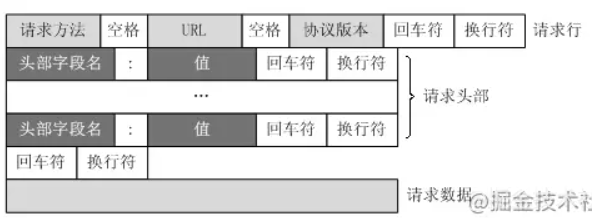
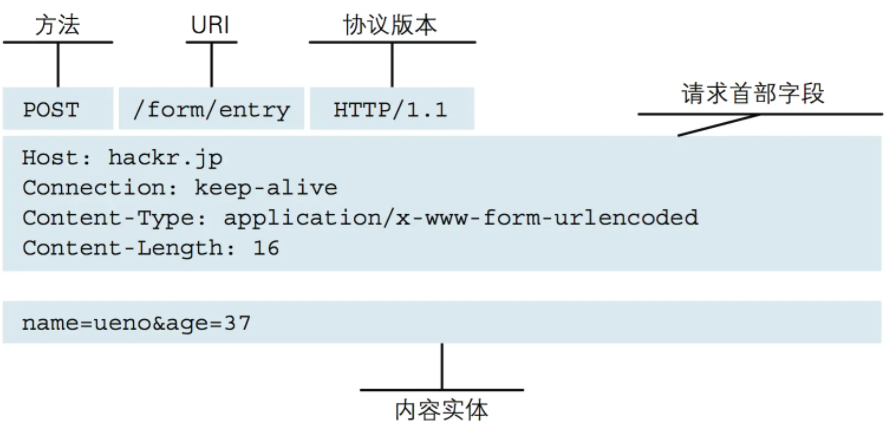
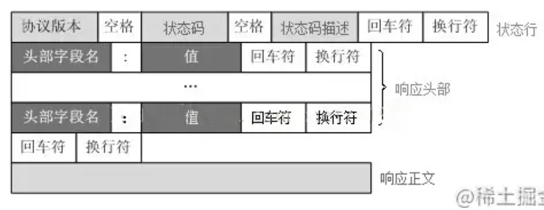
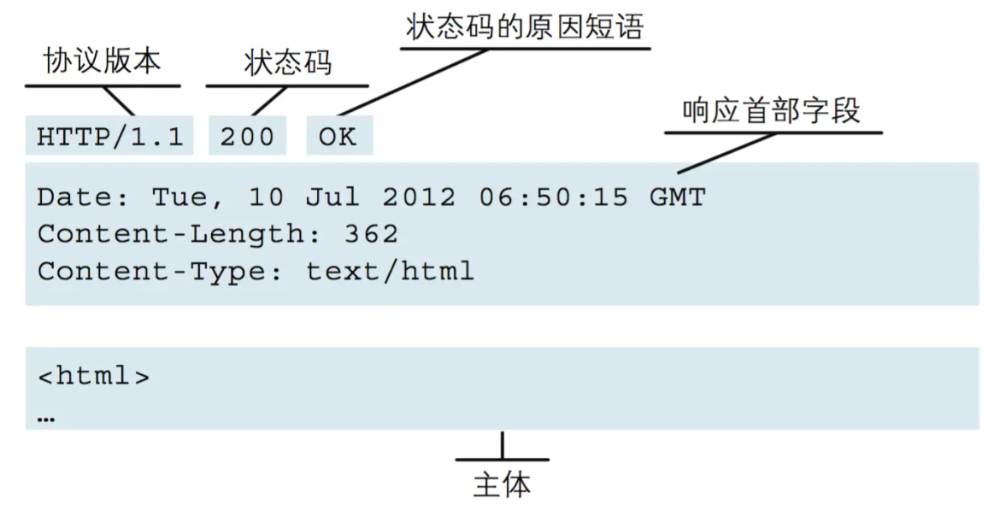

## HTTP协议简介

* HTTP协议定义Web客户端如何从Web服务器请求Web页面，以及服务器如何把Web页面传送给客户端。
* HTTP协议采用了**请求/响应模型**。
  * 客户端向服务器发送一个请求报文，请求报文包含请求的方法、URL、协议版本、请求头部和请求数据。
  * 服务器以一个状态行作为响应，响应的内容包括协议的版本、成功或者错误代码、服务器信息、响应头部和响应数据。
* HTTP是不保存状态的协议，既**无状态协议**。

----

## HTTP版本

### http/1.0与http/1.1

> 这两个最主要的区别是HTTP/1.0采用串行连接，而HTTP/2.0采用的是持久连接

### HTTP/2.0

> 在 HTTP/2 中，有两个非常重要的概念，分别是帧（frame）和流（stream）。 帧代表数据传输的最小的单位，每个帧都有序列标识表明该帧属于哪个流，流也就是多个帧组成的数据流，每个流表示一个请求。

* **新的二进制格式：** HTTP/1.x的解析是基于文本的。基于文本协议的解析存在天然缺陷，文本的表现形式有多样性，要做到全面性考虑的场景必然很多。二进制则不同，只识别0和1的组合。基于这种考虑HTTP/2.0的协议解析采用二进制格式，方便且强大。
* **多路复用：** HTTP/2.0支持多路复用，这是HTTP/1.1持久连接的升级版。多路复用，就是在一个 TCP 连接中可以存在多条流，也就是可以发送多个请求，服务端则可以通过帧中的标识知道该帧属于哪个流（即请求），通过重新排序还原请求。多路复用允许并发的发起多个请求，每个请求及该请求的响应不需要等待其他的请求或响应，避免了线头阻塞问题。这样某个请求任务耗时严重，不会影响到其它连接的正常执行,极大的提高传输性能。
* **头部压缩：** HTTP/1.x的请求和响应头部带有大量信息，而且每次请求都要重复发送，HTTP/2.0使用encoder来减少需要传输的头部大小，通讯双方各自cache一份头部 fields表，既避免了重复头部的传输，又减小了需要传输的大小。
* **服务端推送：** 这里的服务端推送指把客户端所需要的css/js/img资源伴随着index.html一起发送到客户端，省去了客户端重复请求的步骤（从缓存中取）。

---

## 三中连接方式

### **非持久连接**（http/1.0）

> HTTP有无连接的特性，即每次连接只能处理一个请求，收到响应后立即断开连接。HTTP/1.0 版本中每个新的HTTP请求都需要建立一个新的连接,每次通信后都要断开TCP连接。但在现在网站动则几十条HTTP请求的情况下，很容易达到浏览器请求上限，而且每次请求都建立新的tcp连接（每次都有三次握手四次挥别）极大的增加了通信开销。

### **持久连接**（http/1.1）

> 一定时间内同一域名下的HTTP请求，**只要两端都没有提出断开连接**，则持久保持TCP连接状态，其他请求可以复用这个连接通道。HTTP/1.1 实现并默认了所有连接都是持久连接，这样客户端发起多个HTTP请求时就减少了TCP握手造成的网络资源和通信时间的浪费。但是持久连接采用**阻塞模式**，**下次请求必须等到上次响应返回后才能发起**，如果上次的请求还没返回响应内容，下次请求就只能等着（就是常说的线头阻塞）。

### **多路复用**（http/2.0）

> 每个HTTP请求都有一个序列标识符，这样浏览器可以并发多个请求，服务器接收到数据后，再根据序列标识符重新排序成不同的请求报文，而不会导致数据错乱（ [细节参照此文](https://link.juejin.cn?target=https%3A%2F%2Fsegmentfault.com%2Fq%2F1010000005167289)）。同样，服务端也可以并发返回多个响应给浏览器，浏览器收到后根据序列标识重新排序并归入各自的请求的响应报文。并且同一个域名下的所有请求都复用同一个TCP连接，极大增加了服务器处理并发的上限。

---

## HTTP报文

* http报文分为请求报文和响应报文，请求报文是对于客户端而言的，响应报文是对于服务端而言的。

### **请求报文**

> 请求报文是由**请求行**（请求方法、协议版本、请求URI）、**请求首部**（客户端信息等）和**内容实体**（用户信息和资源信息等，可为空）构成。
>
> 
>
> 

### **响应报文**

> 是由状态行（协议版本、状态码）、响应首部（服务器名称、资源标识等）和内容实体（服务端返回的资源信息）构成。
>
> 
>
> 
>
> 

---

## 请求方法

* **GET**（获取 | 检索）：get方法一般用于获取服务器资源
* **POST**（更新 | 创建）：post方法一般用于传输实体主体
* **PUT**（提交）：put方法一般用于传输文件
* **DELETE**（删除）：delete方法用于删除文件
* **HEAD**：head方法用于获取报文首部，不返回报文主体
* **OPTIONS**：options方法用于询问请求URI资源支持的方法

### **GEI与POST**

---

## 状态码

* **1xx表示通知信息的，如请求收到了或正在处理**。

* **2xx表示成功，被正常处理。**

  | 200  | OK，表示从客户端发来的请求在服务器端被正确处理         |
  | ---- | ------------------------------------------------------ |
  | 204  | No content，表示请求成功，但响应报文不含实体的主体部分 |
  | 206  | Partial Content，进行范围请求成功                      |

* **3xx表示重定向，如要完成请求还必须采取进一步的行动。**

  * 301moved permanently，永久性重定向，表示资源已被分配了新的 URL
  * 302found，临时性重定向，表示资源临时被分配了新的 URL
  * 303see other，表示资源存在着另一个 URL，应使用 GET 方法获取资源（对于301/302/303响应，几乎所有浏览器都会删除报文主体并自动用GET重新请求）
  * 304not modified，表示服务器允许访问资源，但请求未满足条件的情况（与重定向无关）
  * 307temporary redirect，临时重定向，和302含义类似，但是期望客户端保持请求方法不变向新的地址发出请求

* **4xx表示客户的差错，如请求中有错误的语法或不能完成。**

  * 400，请求报文存在语法错误
  * 401，表示发送的请求需要有通过 HTTP 认证的认证信息
  * 403，表示对请求资源的访问被服务器拒绝，可在实体主体部分返回原因描述
  * 404，表示在服务器上没有找到请求的资源

* **5xx表示服务器的差错，如服务器失效无法完成请求。**

  * | 500  | internal sever error，表示服务器端在执行请求时发生了错误     |
    | ---- | ------------------------------------------------------------ |
    | 501  | Not Implemented，表示服务器不支持当前请求所需要的某个功能    |
    | 503  | service unavailable，表明服务器暂时处于超负载或正在停机维护，无法处理请求 |

---

## 首部字段

| 通用首部          | 作用（请求报文和响应报文都可能使用）                         |
| ----------------- | ------------------------------------------------------------ |
| Cache-Control     | 控制缓存的行为：`no-cache`（强制向服务器再次验证）、`no-store`（不做任何缓存）、`max-age=111111`（资源可缓存最大时间 秒）、`public`（客户端、代理服务器都可利用缓存）、`private`（代理服务器不可用缓存） |
| Connection        | 浏览器想要优先使用的连接类型： `keep-alive close`（开启和关闭持久连接） |
| Date              | 创建报文时间                                                 |
| Pragma            | 只用于请求报文，客户端要求中间服务器不返回缓存的资源         |
| Via               | 代理服务器相关信息，每经过一个代理服务器就会添加相关信息，用逗号分割 |
| Transfer-Encoding | 传输编码方式：`chunked`分块传输                              |
| Upgrade           | 要求客户端使用的升级协议，需配合`Connection: Upgrade`一起使用：`websocket` |
| Warning           | 缓存相关问题的警告                                           |

| 请求首部            | 作用（请求报文专用）                                         |
| ------------------- | ------------------------------------------------------------ |
| Accept              | 能正确接收的媒体类型：`application/json` `text/plain`        |
| Accept-Charset      | 能正确接收的字符集: `unicode-1-1`                            |
| Accept-Encoding     | 能正确接收的编码格式列表：`gzip deflate`                     |
| Accept-Language     | 能正确接收的语言列表：`zh-cn,zh;1=0.9,en,1=0.8`              |
| Authorization       | 客户端认证信息：`Bearer dSdSdFFlsfdjasd123`，一般存token用   |
| Cookie              | 发送给服务器的Cookie信息                                     |
| Expect              | 期待服务端的指定行为                                         |
| From                | 请求方邮箱地址                                               |
| Host                | 服务器的域名，用于区分单台服务器多个域名的虚拟主机，是HTTP/1.1唯一必须包含的字段。 |
| If-Match            | 两端资源标记比较，只有判断条件为真服务端才会接受请求：`If-Mach: "123456`，和服务端文件标记比较 |
| If-Modified-Since   | 本地资源未修改返回 304（比较时间）                           |
| If-None-Match       | 本地资源未修改返回 304（比较标记）                           |
| User-Agent          | 客户端信息                                                   |
| Max-Forwards        | 限制可被代理及网关转发的次数                                 |
| Proxy-Authorization | 向代理服务器发送验证信息                                     |
| Range               | 请求某个内容的一部分，配合`If-Range`使用                     |
| Referer             | 请求发起页面的原始URI                                        |
| TE                  | 传输编码方式                                                 |

| 响应首部           | 作用（响应报文专用）                                    |
| ------------------ | ------------------------------------------------------- |
| Accept-Ranges      | 告知客户端服务器是否可接受范围请求，是`bytes`，否`none` |
| Age                | 资源在代理缓存中存在的时间                              |
| ETag               | 资源标识，资源发生变化时标识也会发生改变                |
| Location           | 客户端重定向到某个 URL                                  |
| Proxy-Authenticate | 向代理服务器发送验证信息                                |
| Server             | 服务器名字：`Apache Nginx`                              |
| WWW-Authenticate   | 获取资源需要的认证方案                                  |
| Set-Cookie         | 需要存在客户端的信息，一般用于识别用户身份              |

| 实体首部         | 作用（补充请求报文或响应报文相关信息）                       |
| ---------------- | ------------------------------------------------------------ |
| Allow            | 资源的正确请求方式：`GET HEAD POST`                          |
| Content-Encoding | 内容的编码格式：`gzip deflate`                               |
| Content-Language | 内容使用的语言：`zh-CN`                                      |
| Content-Length   | request body 长度（即实体主体的大小）：                      |
| Content-Location | 返回数据的备用地址                                           |
| Content-MD5      | Base64加密格式的内容 MD5检验值                               |
| Content-Range    | 响应主体的内容范围                                           |
| Content-Type     | 内容的媒体类型（如'application/json;charset=UTF-8'则会发送预检请求） |
| Expires          | 内容的过期时间                                               |
| Last_modified    | 内容的最后修改时间                                           |

