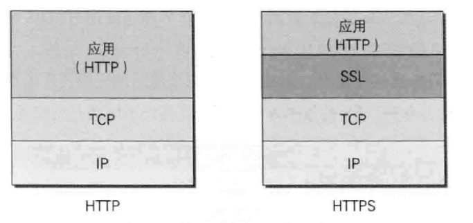
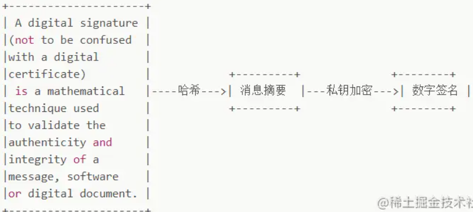
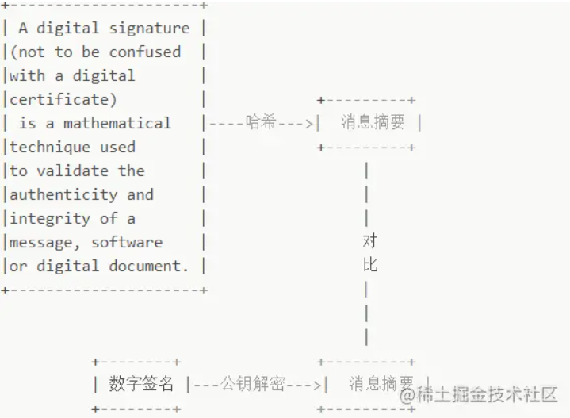
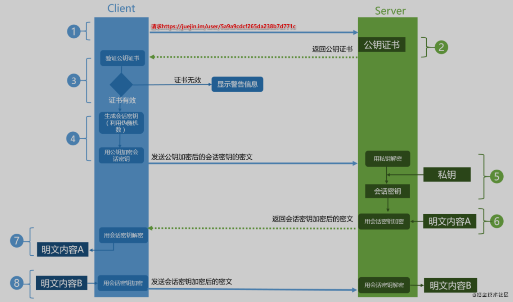

## 一、什么是HTTPS

> HTTPS是在HTTP上建立SSL加密层，并对传输数据进行加密，是HTTP协议的安全版

* **HTTPS主要作用是：**
  * 对数据进行加密，并建立一个信息安全通道，来保证传输过程中的数据安全;
  * 对网站服务器进行真实身份认证。

## 二、为什么需要HTTPS

* 在HTTP协议中有可能存在信息窃取或身份伪装等安全问题。
  * **通信使用明文（不加密）**，内容可能被窃听。
  * **无状态的**，不验证通信方的身份，因此有可能遭遇伪装
  * **无法证明报文的完整性**，所以可能遭篡改。
* 反观HTTPS协议，它比HTTP协议相比多了以下优势
  * **数据隐私性**：内容经过对称加密，每个连接生成一个唯一的加密密钥
  * **数据完整性**：内容传输经过完整性校验
  * **身份认证**：第三方无法伪造服务端（客户端）身份

## 三、HTTPS如何解决HTTP上述问题?

通常，HTTP直接和TCP通信。当使用SSL时，则演变成先和SSL通信，再由SSL和TCP通信了。简言之，**所谓HTTPS，其实就是身披SSL协议这层外壳的HTTP**。在采用SSL后，HTTP就拥有了HTTPS的加密、证书和完整性保护这些功能。也就是说**HTTP加上加密处理和认证以及完整性保护后即是HTTPS**。 

* **加密防止被窃听**：
  * **通信加密**：通过**SSL**或者**TLS**的组合使用，加密HTTP的通信内容。用**SSL建立安通通信线路**之后，就可以在这条线路进行HTTP
  * **内容加密**：对HTTP传输的内容进行加密（报文首部不加密，报文主体加密），需要客户端和服务器具有加密和解密机制。
* **验证对方身份：**
  * **SSL**提供了**证书认证**的方法，证书由第三方机构颁发，用于证明服务器和客户端是实际存在的。
* **防止篡改：**
  * 常用**MD5、SHA-1**等散列值效验，以及来确认**数字签名**的方法。

> TLS/SSL 的功能实现主要依赖于三类基本算法：散列函数 、对称加密和非对称加密，**其利用非对称加密实现身份认证和密钥协商，对称加密算法采用协商的密钥对数据加密，基于散列函数验证信息的完整性**。

### 1、三种加密：解决明文传输问题

#### 对称加密（共享密钥加密）

> 这种方式加密和解密同用一个密钥。**没有密钥就无法对密码解密，也就是说，任何人只要持有密钥就能解密了**。

* 缺点：
  * 以对称加密方式加密时必须将密钥也发给对方。在互联网上转发密钥时，如果通信被监听那么密钥就可会落人攻击者之手，同时也就失去了加密的意义。

#### 非对称加密（公开密钥加密）

> 公开密钥加密使用一对非对称的密钥。一把叫做私有密钥，另一把叫做公开密钥。顾名思义，**私有密钥不能让其他任何人知道，而公开密钥则可以随意发布，任何人都可以获得**。公钥加密的内容，只有私钥可以解开，私钥加密的内容，所有的公钥都可以解开。

* **具体做法**
  * 发送密文的一方使用公钥进行加密处理“密钥”，对方收到被加密的信息后，再使用自己的私有密钥进行解密。这样可以确保交换的密钥是安全的前提下，之后使用对称加密方式进行通信交换报文。利用这种方式，`不需要发送用来解密的私有密钥`，也不必担心密钥被攻击者窃听而盗走。
* 缺点：
  * 对于私钥加密的信息，黑客截获后可以使用公钥进行解密，获取其中的内容；
  * 非对称加密在数据加密解密过程需要消耗一定时间，降低了数据传输效率；
  * 公钥并不包含服务器的信息，使用非对称加密算法无法确保服务器身份的合法性。

#### 对称加密+非对称加密（HTTPS采用这种方式）

> HTTPS将对称加密与非对称加密结合起来，充分利用两者各自的优势。**`在交换密钥环节使用非对称加密方式，之后的建立通信交换报文阶段则使用对称加密方式`。**

* **具体做法是**：
  * **发送密文的一方使用公钥进行加密处理“密钥”，对方收到被加密的信息后，再使用自己的私有密钥进行解密**。这样可以确保交换的密钥是安全的前提下，之后使用对称加密方式进行通信交换报文。所以，HTTPS采用对称加密和非对称加密两者并用的混合加密机制。

---

### 2、数字签名：解决数据遭到串改问题

* **数字签名有两种功效**：

  - 能确定消息确实是由发送方签名并发出来的，因为别人假冒不了发送方的签名。
  - 数字签名能确定消息的完整性,证明数据是否未被篡改过。

* **数字签名如何生成:**

  * 将一段文本先用Hash函数生成消息摘要，然后用发送者的私钥加密生成数字签名，与原文文一起传送给接收者。接下来就是接收者校验数字签名的流程了。 

* **校验数字签名流程**：

  * 接收者只有用发送者的公钥才能解密被加密的摘要信息，然后用HASH函数对收到的原文产生一个摘要信息，与上一步得到的摘要信息对比。如果相同，则说明收到的信息是完整的，在传输过程中没有被修改，否则说明信息被修改过，因此数字签名能够验证信息的完整性。 

  **问题来了，和消息本身一样，公钥不能在不安全的网络中直接发送给接受者，或者说拿到的公钥如何证明是发送方的？**

### 3、解决通信方身份可能被伪装的问题——数字证书

> 客户端无法识别传回公钥是中间人的，还是服务器的，也就是客户端可能拿到的公钥是假的，这是问题的根本，我们可以通过某种规范可以让客户端和服务器都遵循某种约定，那就是通过「第三方认证的方式」
>
> 数字证书认证机构处于客户端与服务器双方都可信赖的第三方机构的立场上。

**数字证书认证机构的业务流程**

1. 服务器的运营人员向第三方机构CA提交公钥、组织信息、个人信息(域名)等信息并申请认证;
2. CA通过线上、线下等多种手段验证申请者提供信息的真实性，如组织是否存在、企业是否合法，是否拥有域名的所有权等;
3. 如信息审核通过，CA会向申请者签发认证文件-证书。**证书包含以下信息：`申请者公钥`、申请者的组织信息和个人信息、签发机构 CA的信息、有效时间、证书序列号等信息的明文，`同时包含一个签名`**。其中签名的产生算法：首先，使用散列函数计算公开的明文信息的信息摘要，然后，采用 CA的私钥对信息摘要进行加密，密文即签名; **【数字签名生成的过程】**
4. 客户端 Client 向服务器 Server 发出请求时，Server 返回证书文件;
5. 客户端 Client 读取证书中的相关的明文信息，采用相同的散列函数计算得到信息摘要，然后，利用对应 CA的公钥解密签名数据，对比证书的信息摘要，如果一致，则可以确认证书的合法性，即服务器的公开密钥是值得信赖的。**【校验数字签名的过程】**
6. 客户端还会验证证书相关的域名信息、有效时间等信息; **客户端会内置信任CA的证书信息(包含公钥)，如果CA不被信任，则找不到对应 CA的证书，证书也会被判定非法。**

**小结**

- CA是颁发证书机构（Certificate Authority）的简称
- 客户端会内置信任CA的证书信息(包含公钥)，服务端返回的证书中有申请者公钥。
- 证书的合法性取决于对比信息摘要
- CA是否信任依赖于客户端内置信任的CA
- 公钥是从服务器请求来的
- 数字签名的生成：网站信息通过特定的算法加密，比如MD5， 加密之后，用第三方机构的私钥（Server的私钥）再次加密
- 数字证书包含两个特别重要的信息：网站公钥、数字签名
- 通信方身份可能被伪装 —— 第三方证书
- 数据无法被解密，但可能被篡改，解决报文可能遭篡改问题 —— 校验数字签名
- 如果仅仅是第三方认证，没有数字签名（只是对网站信息进行第三方机构私钥加密） ，造成数据泄露，所以HTTPS通过`【证书 + 数字签名】`来保证安全

### 4、HTTPS工作流程（TLS 1.2 握手过程）

1. Client发起一个HTTPS请求，连接443端口。这个过程可以理解成是【请求公钥的过程】。
2. Server端收到请求后，会把申请好的数字证书（也可以认为是公钥证书）返回给Client。
3. 浏览器安装后会自动带一些权威第三方机构公钥，使用匹配的公钥对数字签名进行解密。根据签名生成的规则对网站信息进行本地签名生成，然后两者比对【（解密后的签名和对网站信息用hash函数生成的签名比对，其实这也是数字签名校验的过程，上面写的数字签名校验实例没有经过CA）】。通过比对两者签名，匹配则说明认证通过【（也可以说是证书合法，并且客户端内置的CA是信任的）】，不匹配则获取证书失败。
4. 在安全拿到**服务器公钥**后，**客户端Client使用伪随机数生成器随机生成一个对称密钥**，使用【服务器公钥】（证书的公钥）加密这个【对称密钥】，发送给Server(服务器)。
5. 服务器**Server通过自己的私钥，对信息解密**，至此得到了【对称密钥】，此时两者都拥有了相同的【对称密钥】，接下来，就可以通过该对称密钥对传输的信息加密/解密啦。
6. Server使用对称密钥加密“明文内容A”，发送给Client。
7. Client使用对称密钥解密响应的密文，得到“明文内容A”。
8. Client再次发起HTTPS的请求，使用对称密钥加密请求的“明文内容B”，然后Server使用对称密钥解密密文，得到“明文内容B”。

## 四、HTTP 与 HTTPS 的区别

- http 是超文本传输协议，信息是明文传输，HTTPS 协议要比 http 协议`安全`，https 是具有安全性的 ssl 加密传输协议，可防止数据在传输过程中被窃取、改变，确保数据的完整性。

- http 协议的`默认端口`为 80，https 的默认端口为 443。

- http 的连接很简单，是无状态的。https 握手阶段比较`费时`，会使页面加载时间延长 50%，增加 10%~20%的耗电。

- https `缓存`不如 http 高效，会增加数据开销。

- https 协议需要 ca 证书，费用较高，功能越强大的`证书费`用越高。

  