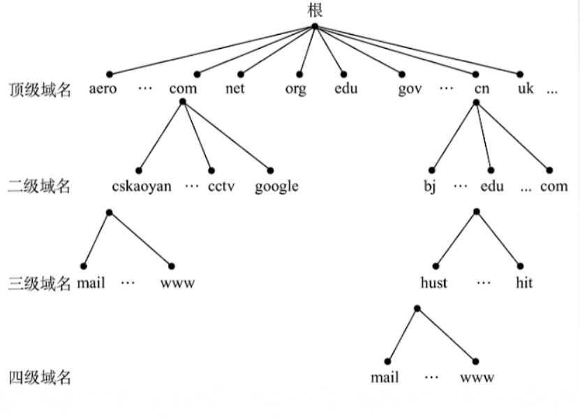

## 什么是DNS

> 最初由于IP长且难记，通过IP访问网站不方便。所以后来通过发明了DNS服务器，这个时候我们访问网站输入网站域名，**DNS服务器就解析我们的域名为IP**。这样我们实际访问的就是对应的ip地址啦。

## 域名

> 域名从左到右等级逐渐增加，分别为三级域名、二级域名、顶级域名 

* 顶级域名
  * 国家顶级域名cn,us,uk。
  * 通用顶级域名com,net,org,gov,int,aero,museum,trave。
  * 基础结构域名/反向域名arpa
* 二级域名
  * 类别域名ac,com,edu,gov,mil,net,org
  * 行政区域名用于我国各省、自治区、直辖市bj,js
  * 自定义域名（必须是唯一的）
* 三级域名
  * www、mail···

### **域名树**

一个网站的location就是从低级域名开始到顶级域名组合而成 

### **域名服务器**

当查找一个域名时会先从本地域名开始查找，如果本地域名查找不到就会到根域名查找，根域名服务器会从顶级域名服务器中查找对应的域名，如果顶级域名还不能查找到对应的IP地址，就会到权限域名服务器中查找 

### 域名服务器解析的两种方式

**分别为递归查询和迭代查询**