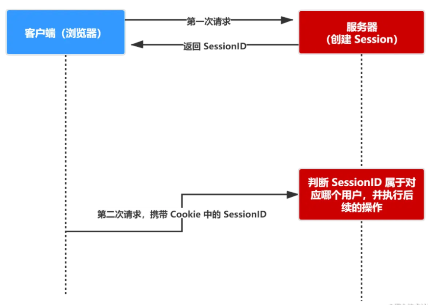

## 为什么需要Cookie、Session、Token

> **HTTP 是无状态的协议（对于事务处理没有记忆能力，每次客户端和服务端会话完成时，服务端不会保存任何会话信息**）：每个请求都是完全独立的，服务端无法确认当前访问者的身份信息，无法分辨上一次的请求发送者和这一次的发送者是不是同一个人。所以服务器与浏览器为了进行会话跟踪（知道是谁在访问我），就必须主动的去维护一个状态，这个状态用于告知服务端前后两个请求是否来自同一浏览器。而这个状态需要通过 cookie 或者 session 去实现。

## Cookie

* **cookie 存储在客户端：** cookie 是服务器发送到用户浏览器并保存在本地的一小块数据，这个数据通常对应于一个域名，当浏览器再次访问这个域名时，便使这个cookie可用。 它会在浏览器下次向同一服务器再发起请求时被携带并发送到服务器上。
* **cookie 是不可跨域的：** 每个 cookie 都会绑定单一的域名，无法在别的域名下获取使用。

### **怎么使用 cookie？**

语法：`document.cookie = "name=value;expires=evalue; path=pvalue; domain=dvalue; secure;"`

**cookie 重要的属性**

| 属性           | 说明                                                         |
| -------------- | ------------------------------------------------------------ |
| **name=value** | 键值对，设置 Cookie 的名称及相对应的值，都必须是**字符串类型** - 如果值为 Unicode 字符，需要为字符编码。 - 如果值为二进制数据，则需要使用 BASE64 编码。 |
| **domain**     | 指定 cookie 所属域名，默认是当前域名                         |
| **path**       | **指定 cookie 在哪个路径（路由）下生效，默认是 '/'**。 如果设置为 `/abc`，则只有 `/abc` 下的路由可以访问到该 cookie，如：`/abc/read`。 |
| **maxAge**     | cookie 失效的时间，单位秒。如果为整数，则该 cookie 在 maxAge 秒后失效。如果为负数，该 cookie 为临时 cookie ，关闭浏览器即失效，浏览器也不会以任何形式保存该 cookie 。如果为 0，表示删除该 cookie 。默认为 -1。 - **比 expires 好用**。 |
| **expires**    | 过期时间，在设置的某个时间点后该 cookie 就会失效。 一般浏览器的 cookie 都是默认储存的，当关闭浏览器结束这个会话的时候，这个 cookie 也就会被删除 |
| **secure**     | 该 cookie 是否仅被使用安全协议传输。安全协议有 HTTPS，SSL等，在网络上传输数据之前先将数据加密。默认为false。 当 secure 值为 true 时，cookie 在 HTTP 中是无效，在 HTTPS 中才有效。 |
| **httpOnly**   | **如果给某个 cookie 设置了 httpOnly 属性，则无法通过 JS 脚本 读取到该 cookie 的信息，但还是能通过 Application 中手动修改 cookie，所以只是在一定程度上可以防止 XSS 攻击，不是绝对的安全** |

## Session

- **session 是另一种记录服务器和客户端会话状态的机制，是基于 cookie 实现的，session 存储在服务器端，sessionId 会被存储到客户端的cookie 中**
- **session 认证流程：**
  - 用户第一次请求服务器的时候，服务器根据用户提交的相关信息，创建对应的 Session
  - 请求返回时将此 Session 的唯一标识信息 SessionID 返回给浏览器
  - 浏览器接收到服务器返回的 SessionID 信息后，会将此信息存入到 Cookie 中，同时 Cookie 记录此 SessionID 属于哪个域名
  - 当用户第二次访问服务器的时候，请求会自动判断此域名下是否存在 Cookie 信息，如果存在自动将 Cookie 信息也发送给服务端，服务端会从 Cookie 中获取 SessionID，再根据 SessionID 查找对应的 Session 信息，如果没有找到说明用户没有登录或者登录失效，如果找到 Session 证明用户已经登录可执行后面操作。 

## Cookie 和 Session 的区别

* **安全性：** Session 比 Cookie 安全，Session 是存储在服务器端的，Cookie 是存储在客户端的。
* **存取值的类型不同**：Cookie 只支持存字符串数据，想要设置其他类型的数据，需要将其转换成字符串，Session 可以存任意数据类型。
* **有效期不同：** Cookie 可设置为长时间保持，比如我们经常使用的默认登录功能，Session 一般失效时间较短，客户端关闭（默认情况下）或者 Session 超时都会失效。
* **存储大小不同：** 单个 Cookie 保存的数据不能超过 4K，Session 可存储数据远高于 Cookie，但是当访问量过多，会占用过多的服务器资源。

---

## Token

* token 是在客户端频繁向服务端请求数据，服务端频繁的去数据库查询用户名和密码并进行对比，判断用户名和密码正确与否，并作出相应提示，在这样的背景下，token 便应运而生。
* **简单 token 的组成：** uid(用户唯一的身份标识)、time(当前时间的时间戳)、sign（签名，token 的前几位以哈希算法压缩成的一定长度的十六进制字符串）
* **特点：**
  - **服务端无状态化、可扩展性好**
  - **支持移动端设备**
  - 安全
  - 支持跨程序调用

**Token 的身份验证流程：**

1. 客户端使用用户名跟密码请求登录
2. 服务端收到请求，去验证用户名与密码
3. 验证成功后，服务端会签发一个 token 并把这个 token 发送给客户端
4. 客户端收到 token 以后，会把它存储起来，比如放在 cookie 里或者 localStorage 里
5. 客户端每次向服务端请求资源的时候需要带着服务端签发的 token
6. 服务端收到请求，然后去验证客户端请求里面带着的 token ，如果验证成功，就向客户端返回请求的数据 

**每一次请求都需要携带 token，需要把 token 放到 HTTP 的 Header 里**。**基于 token 的用户认证是一种服务端无状态的认证方式，服务端不用存放 token 数据。用解析 token 的计算时间换取 session 的存储空间，从而减轻服务器的压力，减少频繁的查询数据库**

**token 完全由应用管理，所以它可以避开同源策略**

